# Code as a Learning Machine: How to Use Codex for Robot Control

**Yuna Oikawa**
**Detailed working manuscript, 5 September 2026**

> This document is an evidence-grounded first full draft. The experimental
> claims are restricted to immutable robot captures, recorded robot state,
> run journals, source history, and tests preserved in the accompanying
> repository. Author list, affiliation, target venue, and final formatting
> remain to be decided.

## Abstract

Robot learning usually treats a policy architecture as fixed and improves its
behavior by optimizing numerical parameters. This paper studies a broader
learning substrate: the executable robot repository itself. In the proposed
view, perception modules, coordinate transforms, geometric models, motion
controllers, state machines, recovery rules, tests, and success evaluators are
all learnable components. A coding agent observes the evidence produced by a
physical trial, diagnoses the failure, modifies this executable machinery, and
runs another bounded experiment. The resulting process is a form of empirical
risk minimization over programs rather than only over neural-network weights.

We report two contact-rich case studies in a compact wet-laboratory cell. In
the first, Codex converted twelve visually verified teleoperated demonstrations
into a contact-relative controller for an incubator door. The learned program
combined a relative SE(3) pull trajectory, head-camera RGB-D plane alignment,
gripper-aperture contact tests, a 5 mm proof pull, checkpointed execution, and
an independently registered open/closed endpoint classifier. The autonomous
run started from a verified closed state and reached a verified open state; a
separate demonstrated push trajectory subsequently reached the verified closed
state. In the second case study, Codex produced a controller that side-pinched
and removed a culture-media bottle cap without a cap-specific teleoperation
demonstration and without task-specific neural-network training. From one
human target click, seven open-jaw pose observations, natural-language
corrections, and physical trial evidence, the program constructed a local
image-to-motion Jacobian, represented the cap relative to its supporting bottle,
and added independent contact, removal, and retention tests. The cap was lifted
9.175 mm and transported 107.415 mm while the normalized gripper aperture
remained near 0.201.

Neither promoted path depended on a task-specific neural perception model at
runtime. Instead, the code agent selected and composed a heterogeneous tool
graph: Record3D RGB-D acquisition, OpenCV video and image operations, AprilTag
registration, HDF5 demonstration mining, numerical SE(3) and Jacobian
operations, Mink/MuJoCo kinematics and collision checks, robot RPC/CAN
interfaces, gripper-aperture feedback, subprocess isolation, immutable hashes,
tests, and Git. SAM was available and useful in adjacent scene-reconstruction
work, but empirical comparison kept it out of these two promoted critical
paths. Thus the relevant advantage of the language model was not merely neural
visual recognition; it was the ability to select, connect, constrain, replace,
and sometimes reject external tools as the physical evidence changed.

These experiments do not establish that program search should replace learned
visuomotor policies. They instead suggest a complementary hierarchy: a code
agent can learn the sensing, tool selection, geometry, control flow, and
evaluation machinery within which a vision-language-action model or another
motor policy may be called. The central advantage is not code generation by
itself, but the ability to change the hypothesis class when physical evidence
shows that the current one is wrong, and to preserve the successful result as
an inspectable, testable, and replayable artifact.

## 1. Introduction

A robot can fail even when its motor controller is locally competent. It may
be looking through the wrong camera, using a mirrored coordinate convention,
tracking a shadow instead of a handle, confusing a gripper component with a
white cap, assuming that a bottle rests on a surface when it is actually
recessed between platforms, or declaring success merely because a close command
was sent. None of these errors is naturally described as a small correction to
the weights of a fixed action network. They concern the executable structure
around the policy: what is observed, how observations are converted into world
coordinates, which model is trusted, what action is allowed next, and what
physical evidence is sufficient to call the task complete.

This paper explores the hypothesis that the code implementing this structure
can itself be a learning medium. We use *code* broadly. The learned artifact is
not only a generated Python function. It is a versioned repository containing
sensor adapters, calibration data, task semantics, geometric representations,
motion primitives, controller logic, simulator models, evidence gates,
recovery procedures, and tests. A trial changes this artifact when the observed
outcome contradicts its current assumptions. In this sense, the repository
plays a role analogous to a model, a commit records an accepted update, and a
physical robot trial supplies an empirical training example.

The optimizer in our experiments was Codex, used interactively with a human
operator and a physical bimanual robot. The operator supplied task intent,
occasional semantic corrections, and permission for bounded physical trials.
Codex inspected the repository and recorded observations, introduced or
modified tools, executed tests and robot stages, compared outcomes with explicit
criteria, and retained successful changes in version control. OpenAI's own
Codex use-case material describes difficult tasks as amenable to a scored
improvement loop [7]; our interest is what happens when the score is grounded
in physical evidence and the mutable artifact is an entire robot stack.

Two manipulation capabilities emerged from this process:

1. **Incubator-door opening and closing.** Twelve successful teleoperation
   demonstrations were not replayed as absolute joint sequences. They were
   compiled into a contact-relative motion program and surrounded by newly
   written alignment, contact-proof, checkpoint, recovery, and endpoint logic.
2. **Culture-media cap removal and held transport.** No cap-specific
   teleoperation trajectory and no task-specific policy training were used.
   The agent constructed an object adapter and a visual servo from a single
   target click and seven robot observations, then learned from physical
   approach, grasp, lift, and transport attempts.

The two cases are deliberately complementary. The door task asks how a code
agent can turn demonstrations into a more robust executable procedure. The cap
task asks whether the same learning process can create a new procedure without
an action demonstration. Both are contact-rich, both contain severe perceptual
ambiguity, and both require evidence beyond commanded motion.

The contributions of this paper are:

1. **A program-level formulation of empirical robot learning.** We formalize
   the robot repository as a hypothesis whose code and configuration are
   updated against measurable physical loss.
2. **An evidence-gated agentic development loop.** We separate mutable task
   logic from immutable observations and independent evaluators, so that a
   program cannot appear better merely by weakening its own definition of
   success.
3. **A demonstration-grounded articulated manipulation case study.** We show
   how heterogeneous door demonstrations, RGB-D geometry, gripper state, and
   endpoint evidence were compiled into a reusable autonomous state machine.
4. **A demonstration-free cap-removal case study.** We show that a code agent
   can acquire a local perception-and-control program from sparse interaction,
   producing verified physical removal and retained transport without a
   cap-specific action demonstration.
5. **An auditable account of how the capabilities emerged.** Rather than
   reporting only the final scripts, we connect failures, observations, code
   changes, runs, tests, and commits. This chronology is important because the
   learning signal is contained in the corrections.
6. **Empirical tool-graph learning.** We identify the non-neural sensing,
   vision, geometry, simulation, hardware, and software-engineering tools used
   in each promoted capability, and distinguish them from tools that were only
   explored or deliberately removed from the runtime path.

## 2. Related Work

### 2.1 Learned visuomotor and vision-language-action policies

Vision-language-action (VLA) models learn mappings from visual and linguistic
observations to robot actions. RT-2 co-fine-tunes vision-language models on
Internet-scale vision-language data and robot trajectories by representing
actions as tokens [1]. OpenVLA provides a 7B-parameter open model trained on
970,000 robot demonstrations and studies efficient adaptation to downstream
tasks [2]. These systems are compelling because a shared parameterization can
transfer semantic and motor regularities across objects, instructions, and
embodiments.

Our claim is not that program learning is a universally better motor policy.
A learned policy can supply smooth, reactive behavior that would be tedious to
hand-code. The distinction is one of level and hypothesis space. A fixed VLA
typically receives a predetermined sensor interface and emits actions in a
predetermined action space. The learning process reported here can change that
interface, add a camera-registration procedure, import a segmenter, alter a
MuJoCo scene, construct a task-specific state machine, add a mechanical contact
probe, or replace the success test. A VLA can therefore be one callable module
inside the learned program rather than an excluded alternative.

### 2.2 Language models as planners and robot-program generators

ProgPrompt represents available actions and objects in program-like prompts to
constrain language-model task plans [3]. Code as Policies uses language models
to synthesize executable robot policy code that composes perception outputs,
control APIs, spatial operations, and third-party libraries [4]. VoxPoser uses
language-model code generation and vision-language grounding to construct 3-D
value maps for model-based trajectory synthesis [5]. These works established
that code is a useful representation for robot reasoning and control.

The focus here is different. We do not primarily evaluate whether a language
model can generate a policy from a prompt in one pass. We study a persistent
physical learning loop in which the generated repository is repeatedly revised
after contact outcomes. The agent may modify not only the action program but
also the observation model, calibration, simulator, evidence contract, tests,
and recovery behavior. The accepted artifact is tied to immutable hardware
evidence and a Git history. Thus the unit of learning is a tested repository
revision, not only a generated action sequence.

### 2.3 Language models and external tools

Toolformer trains a language model to decide which external API to call, when
to call it, which arguments to supply, and how to incorporate the returned
result [9]. ReAct interleaves language reasoning with actions that query
external information sources or environments [10]. Together with Code as
Policies [4], these results motivate a view of the LLM as an orchestrator of
specialized capabilities rather than a self-contained predictor.

Our experiments extend this view in two directions. First, the selected tools
operate on a physical control stack: camera services, depth arrays,
fiducials, numerical solvers, a simulator, robot RPC/CAN interfaces, and
mechanical feedback. Second, a tool call is not the final learned artifact.
Physical loss can cause the agent to write a new adapter, change the connection
or authority between tools, add an evaluator, and commit the revised graph for
later deterministic execution. The object of empirical selection is therefore
a persistent tool-using program, not only an inference-time sequence of API
calls.

### 2.4 Foundation perception and model-based validation

The Segment Anything Model (SAM) provides promptable, transferable object masks
[6]. Such a model broadens the set of perception tools a code agent can deploy.
However, the present experiments also demonstrate an important counterpoint:
the most general-looking visual tool need not be the most reliable source of a
particular control signal. In the fixed Pasteur door task, registered depth and
a demonstrated contact frame were more stable than repeatedly segmenting a
partially occluded recessed handle. In the cap task, a relational description
(`small white component above this coloured bottle neck`), an immutable click,
and gripper geometry were easier to verify than a free-form semantic mask. SAM
was useful in the broader scene-reconstruction work surrounding these
experiments, but it was not made a mandatory dependency of the two promoted
success paths.

MuJoCo supplies contact-aware model-based simulation and validation [8]. We use
simulation as one critic of a trajectory, not as ground truth. A reconstructed
scene can reject obvious collisions before a physical trial, but incomplete
geometry can also produce false positives. The cap pipeline therefore permits
one narrowly scoped exception: an exact, hashed route already validated on
hardware may override a simulator-only collision warning. The exception does
not transfer to a changed route. This illustrates a general principle of code
learning: tools are selected and weighted according to empirical reliability,
and disagreement is made explicit in control flow.

## 3. Learning Executable Machinery

### 3.1 From parameter learning to program learning

Conventional empirical risk minimization selects parameters \(\theta\) for a
fixed model family \(f_\theta\):

\[
\theta^* = \arg\min_{\theta}\; \widehat{L}_{\mathrm{emp}}(f_\theta;D).
\]

We instead consider a hypothesis space of executable robot repositories
\(\mathcal{H}_{\mathrm{code}}\). A program \(P\) includes source code and all
execution-relevant artifacts:

\[
P = (S, C, M, K, \Pi, V, R, T),
\]

where \(S\) denotes sensor adapters, \(C\) calibration and coordinate
conventions, \(M\) scene and object models, \(K\) perception modules, \(\Pi\)
controllers and motion primitives, \(V\) verification logic, \(R\) recovery
rules, and \(T\) tests and task contracts. Program learning seeks

\[
P^* = \arg\min_{P\in\mathcal{H}_{\mathrm{code}}}
\widehat{L}_{\mathrm{emp}}\bigl(\operatorname{Execute}(P);D\bigr)
\]

subject to safety and evidence-coverage constraints.

This notation should not imply that we enumerate all programs or differentiate
through source code. Codex performs language-guided, non-gradient search. It
uses the current repository, human intent, test failures, images, depth,
kinematics, and robot-state traces to propose a structured update. The proposal
is executed only after offline checks and, when appropriate, a bounded hardware
trial.

### 3.2 The empirical signal

For a trial \(i\), we distinguish five observable losses:

\[
L_i = w_{id}L_{id} + w_cL_{contact} + w_pL_{progress}
      + w_eL_{endpoint} + w_rL_{runtime}.
\]

- \(L_{id}\) measures whether the controller is acting on the intended object
  or articulated body.
- \(L_{contact}\) measures whether the gripper has established the intended
  physical relation rather than merely issuing a close command.
- \(L_{progress}\) measures task-relevant physical change, such as a door
  rotating or a cap leaving its bottle.
- \(L_{endpoint}\) measures whether the final world state matches a separately
  recorded task endpoint.
- \(L_{runtime}\) includes latency, unnecessary trials, and time-to-adaptation.

In practice, the evaluator is often lexicographic rather than a single weighted
sum. Identity and contact gates must pass before progress motion is allowed;
endpoint evidence must pass before a capability is promoted. Missing evidence,
stale images, unsafe geometry, or ambiguous endpoints are hard failures rather
than small penalties. This makes the state machine easier to audit and reduces
the chance that a large apparent progress term hides the wrong contact.

### 3.3 Preventing evaluator self-deception

If an agent may change both a controller and its score, naive program search can
reduce loss by weakening the evaluator. We used four safeguards:

1. **Immutable observations.** Selected RGB-D captures and robot states are
   stored under timestamped paths and referenced by content or route hashes.
2. **Independent modalities.** Commanded motion is not accepted as physical
   progress. Images, depth, joint-derived end-effector pose, and gripper
   aperture must agree where available.
3. **Promotion scope.** The evaluator returns the longest verified behavior
   prefix. For example, cap removal and transport can be promoted while
   placement remains disabled.
4. **Versioned tests and provenance.** Tests, run journals, configuration, and
   Git commits preserve the accepted hypothesis and permit later re-audit.

These safeguards do not make the evaluator infallible. They make changes to the
meaning of success visible and contestable.

### 3.4 The physical patch loop

The operational learning loop was:

```text
task intent and current repository
              |
              v
fresh observation -> measurable discrepancy -> causal hypothesis
                                              |
                                              v
                                      code/config patch
                                              |
                            offline tests and simulation
                                              |
                                bounded hardware stage
                                              |
                   image + depth + pose + aperture evidence
                          /                         \
                  criterion passes            criterion fails
                         |                          |
                 commit and promote      diagnose and patch again
```

A trial did not need to complete the full task to be informative. A 5 mm pull
could test handle retention; a 10 mm vertical lift could test cap detachment;
an open-jaw pose could estimate one column of an image Jacobian. This reduced
the cost of assigning credit. It also let the agent replace vague judgments
such as “almost grasped” with measurable predicates.

### 3.5 What counts as learning in this paper

We call the process learning when three conditions hold:

1. observed outcomes change future executable behavior;
2. the change persists outside the conversational context; and
3. the retained behavior is selected by an empirical evaluator.

Under this definition, a hard-coded program written once from complete prior
knowledge is not the phenomenon of interest. A program revised after evidence
is. The fact that a learned artifact is readable source code rather than a
tensor does not remove the empirical update. Conversely, not every chat message
is a learning step. Temporary manual coordinates, diagnostic scripts, and
failed hypotheses become learned behavior only if they are deliberately
retained in the normal execution path.

### 3.6 Learning the tool graph, not only tool parameters

The executable hypothesis also contains a directed tool graph

\[
G_P=(V_P,E_P),
\]

where a node may be a sensor service, file decoder, vision routine, geometric
estimator, simulator, optimizer, robot interface, evaluator, or persistence
mechanism, and an edge is an explicitly typed exchange of images, metric
depth, transforms, trajectories, state, or evidence. Program search can change
both the computation within a node and the topology of this graph. It can add
a depth observation before contact, replace a semantic mask with a geometric
predicate, put a simulator before hardware execution, or add an aperture gate
between closure and progress.

This is a larger change of hypothesis class than tuning thresholds inside a
fixed perception-action pipeline. It is also one of the practical advantages
of an LLM code agent: the model can inspect an unfamiliar API, write an
adapter, invoke a command-line process, combine its output with existing robot
state, test the connection, and preserve the resulting composition as normal
source code. The acquired controller need not call the LLM after this
composition is compiled.

We use *external tool* in a functional sense: a capability outside the
task-specific neural policy, including third-party libraries, sensor
applications, physics and numerical packages, hardware services, and
versioning or test infrastructure. Repository-local wrappers around those
capabilities are part of the learned program. We do not claim that every
library was downloaded during the successful session; the historical evidence
supports the narrower and more important claim that Codex selected, composed,
and revised these tools. Nor do we claim that neural systems are intrinsically
unable to call tools. A tool-augmented neural agent can do so. The comparison
is with a conventional fixed VLA training run, whose sensor/action contract
and surrounding tool graph normally remain fixed while its weights change.

## 4. Experimental System and Audit Method

### 4.1 Robot cell

The Pasteur cell contains two six-degree-of-freedom Piper arms connected through
CAN, with physical/software side conventions handled by the repository. The
reported door and cap executions use the physical right arm. Its end effector
is an NYU string-driven Dynamixel gripper. An iPhone provides a fixed head RGB-D
view through Record3D, and a second iPhone provides a right-wrist RGB view. A
Meta Quest interface was used to record teleoperation demonstrations. MuJoCo
models represent the Piper mechanism, platforms, incubator, microscope, and
task objects for offline visualization and collision checking.

The distinction between physical and software side names matters. Historical
MuJoCo branch labels included `left_arm_*` even when the physical executor was
the right arm. The audited task profile, RPC command, and camera map—not a mesh
or branch name—determine the physical side. This convention error was itself a
previous source of confusing visualization and motivates treating coordinate
semantics as learned, tested artifacts.

### 4.2 Observation and command interfaces

The agent did not directly produce motor currents. It worked through
deterministic repository adapters that expose joint and Cartesian motions,
gripper commands, camera capture, and state queries. A task stage writes its
inputs and outputs to a run directory. Relevant observations include:

- RGB and metric depth from the fixed head camera;
- RGB from the right-wrist camera;
- measured physical joint angles and forward-kinematic end-effector pose;
- normalized gripper aperture, where 1 denotes open and 0 denotes fully closed;
- timestamps and hashes for captured evidence and validated trajectories.

The code agent could alter the logic that consumes these observations, but the
raw evidence and measured state were retained independently.

### 4.3 Retrospective audit

Substantial Petri-dish, scene-reconstruction, teleoperation, and ACT-training
work occurred in the repository after the two experiments. We therefore did
not infer the historical mechanism only from the present working tree. For
each case, we cross-checked:

1. immutable capture directories and run journals;
2. demonstration files and compiled references;
3. the Git trees at the capability commits;
4. the access-controlled Codex event log for the experimental day; and
5. current regression tests for the unchanged task-specific modules.

For the door session, the audit covered 12:43–19:08 JST on 8 August 2026 and
identified 58 successful patch applications across 17 files. For the cap
session, it covered 16:35–18:37 JST on 6 August 2026 and identified 38 successful
patch applications. Credential-bearing log lines were excluded from analysis
and are not reproduced. This audit allows us to separate exploratory commands
from the final normal path and to avoid attributing later improvements to an
earlier success.

### 4.4 Visual evidence and figure provenance

The figures below are assembled from the preserved experimental records rather
than from illustrative re-enactments. Every photographic panel is a saved head
or wrist-camera frame from a demonstration, diagnostic stage, or autonomous
run. Every depth panel is the color rendering stored beside the corresponding
metric depth capture. Figure preparation was limited to extraction of a video
frame, cropping, resizing, JPEG compression, panel layout, and text labels. No
generative fill, object insertion, object removal, or photometric alteration
was used. Some figures deliberately pair a full frame with a crop of the same
capture so that both global state and small contact geometry remain visible.
The twelve composites contain 86 displayed panels in total; this is not 86
independent trials because full-frame/crop pairs and synchronized RGB/depth
views intentionally repeat an observation at different scales or modalities.

The green regions in the registered door endpoint panels are not manual
illustrations. They are contemporaneous evaluator overlays showing the
registered dynamic depth mask. They are retained because they reveal what the
endpoint classifier actually measured, including its remaining sensitivity to
robot occlusion. The colorized depth images are useful qualitative views, but
all numerical claims are computed from the stored metric arrays and robot
state, not inferred from colormap hue. Appendix E maps each composite to its
source captures. The curated composites are stored under version control
because the full `data/` tree is intentionally excluded from Git; the raw
captures remain the authoritative evidence.

## 5. Case Study A: Learning to Open and Close an Incubator Door

### 5.1 Task and evidence contract

The incubator has a recessed handle and a hinged front door. The physical right
arm must approach the handle, close the gripper around it, pull along the door's
articulated motion, and retreat. Closing is performed by pushing the door with
an open gripper along a separate demonstrated trajectory.

The opening task was considered successful only if:

1. the initial head RGB-D observation classified the door as closed;
2. the gripper established a stable non-empty closure;
3. the grasp survived a short proof pull;
4. the long pull was checkpointed and stopped on detected loss of contact; and
5. a new head RGB-D observation independently matched the verified open
   endpoint.

This contract intentionally separates *grasp retention* from *door state*. A
grasp may slip after it has already imparted enough motion to open the door.
Conversely, a gripper may remain partially open on the wrong piece of geometry
without moving the door. Neither signal alone is a complete task evaluator.

### 5.2 Before the capability existed

Before the door-specific implementation, the repository provided generic
teleoperation and replay. It did not contain a compiler for successful door
demonstrations, a registered depth representation of the door plane, a
mechanical contact proof, an open/closed endpoint classifier, or a single
state-machine executor that connected those components.

Absolute replay was inadequate for several measured reasons. Even among twelve
successful demonstrations, contact positions varied with standard deviations
of 6.5, 10.8, and 4.7 mm along the three Cartesian axes. The largest positional
span was 36.1 mm. The median rotational deviation was 4.62 degrees and the
maximum was 9.28 degrees. Those variations are comparable to the tolerance of
a recessed handle. Replaying one absolute trajectory after a modest change in
camera, door, or robot alignment could therefore close beside the handle or
contact it at the wrong angle.

Perception was also deceptive. A dark feature near the target looked like a
gripper-compatible handle in some images but was identified by the human
operator as a shadow. The wrist view contained a red EYELA label attached to
the same rigid front assembly, but the label was not the recessed handle and
its visible components changed with illumination. Finally, a close command was
not evidence of contact: observed normalized apertures ranged from useful
partial closures near 0.3–0.4 to nearly empty full closures near 0.005.

### 5.3 Selecting and compiling demonstrations

The raw demonstration pool contained 57 candidate door-opening recordings. We
first ranked them by net pull during the closed-gripper interval. This ranking
was only a candidate filter: a large motion could still be a failed grasp. The
final head images of the top candidates were then inspected, and twelve runs
whose doors were visibly open were fixed as the verified set.

For every accepted demonstration, the compiler extracted:

- the frame at which the jaws began to close;
- a pre-close frame ten samples earlier;
- the first post-contact frame approximately 5 mm along the pull; and
- the last frame before the gripper reopened.

The contact-pose medoid was demonstration
`door_open_20260703_163756`, with pre-close frame 46, close frame 56,
proof frame 68, and release frame 203. Its contact-to-proof segment lasted
0.40 s and moved 5.5 mm. The contact-to-release trajectory contained 148
samples over 4.93 s and produced approximately 211 mm of net motion.

Instead of retaining the medoid trajectory in its recorded world coordinates,
the compiler expressed every pose relative to the contact frame:

\[
{}^{C}T_t = ({}^{W}T_C)^{-1}{}^{W}T_t.
\]

At runtime, a newly estimated contact transform \({}^{W}T'_C\) retargets the
motion:

\[
{}^{W}T'_t = {}^{W}T'_C {}^{C}T_t.
\]

This preserves the demonstrated local opening motion while allowing bounded
translation and yaw correction before contact.

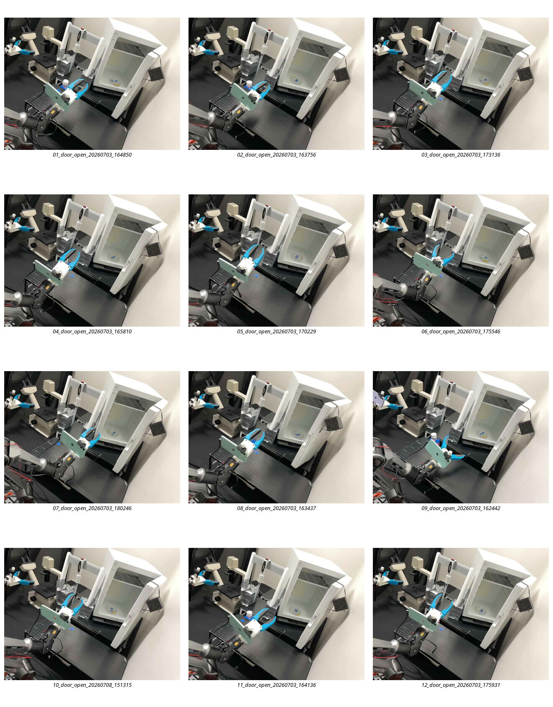

**Figure 1. Visual verification of the demonstration set.** Each panel is the
terminal head-camera video frame from one of the twelve demonstrations admitted
to the compiler. The open interior is visible in every accepted endpoint. This
manual visual gate followed trajectory-based ranking, preventing large arm
motion alone from being treated as a successful opening label.

### 5.4 Chronology of empirical correction

The capability did not emerge from one generated script. The decisive sequence
on 8 August 2026 was as follows.

#### 12:34–13:32 JST: discovering that the current pose was not contact

The first probes used open-jaw retreat/orient stages, measured lateral steps,
and demonstration hover/pre-close poses. Comparing the live end-effector pose
with successful demonstrations showed that the initial pose previously treated
as a contact anchor was approximately 93 mm in front of the actual contact
pose. Small relative commands also accumulated wrist-orientation drift. The
result was an important representational correction: the live starting pose
could not define the contact coordinate system.

The normal path was changed to start from the demonstrated pre-close transform,
retargeted by a measured door-plane yaw and only a bounded visual lateral
correction. Manual sequences of incremental coordinates remained diagnostic
primitives but were removed from the autonomous opening path.

#### 13:33–13:46 JST: a short proof succeeded, but a long pull failed

The first structured attempt closed at the demonstration contact, observed an
aperture of 0.4123, and retained 0.3663 after the 5 mm proof motion. These values
looked like a real, non-empty grasp. The program then streamed the remaining 135
trajectory points in one uninterrupted command sequence.

At the end, the aperture had fallen to 0.0034, indicating that the jaws were
nearly fully closed and no longer holding the handle. The endpoint image did
not support an open door. This trial falsified the assumption that a successful
short proof guaranteed a successful long articulated pull.

The resulting patch slowed the pull by a factor of two, split it into
15-frame checkpoints, and re-read the aperture between chunks. When contact was
lost, the controller would stop rather than blindly complete the trajectory,
retreat 15 mm, and open the gripper.

#### 13:52–14:06 JST: repeated non-empty closures still slipped

Three principal retries reached plausible contact and proof apertures:

| Retry | Aperture after close | Aperture after proof | Later outcome |
| --- | ---: | ---: | --- |
| 2 | 0.407 | 0.365 | slipped near demonstration frame 171 |
| 4 | 0.323 | 0.319 | slipped near demonstration frame 171 |
| 5 | 0.293 | 0.291 | slipped near demonstration frame 171 |

These trials showed that aperture alone could reject an empty grasp but could
not prove that the recessed handle was engaged in the best orientation. They
also exposed several tempting but unreliable strategies. Repeatedly centering
the red label could over-correct because the label was an auxiliary feature,
not the contact surface. Applying visual increments from a moving starting pose
could distort the demonstrated contact transform. Direct joint-level
micro-adjustment increased a measured joint error to 0.178 rad in one probe and
was abandoned for the normal path.

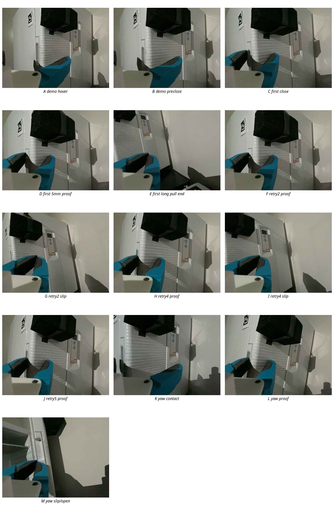

**Figure 2. The contact hypothesis changing under physical evidence.** Panels
A--E show the demonstrated hover and pre-close poses, the first partial
closure, the first 5 mm proof, and the failed long-pull endpoint. Panels F--J
show that retries 2, 4, and 5 could pass the non-empty closure/proof test and
still slip later. Panels K--M show the depth-yaw-aligned contact, proof, and
eventual slip after the door had moved open. The repeated visual pattern is why
the final program treats aperture proof as necessary but not sufficient.

#### 14:11–14:48 JST: depth-plane yaw replaced shadow-based alignment

The head camera captured eight RGB-D frames. Candidate low-saturation points in
the incubator region were fit with a vertical plane using RANSAC. The resulting
front-plane yaw was approximately -5.33 degrees and was later stored as a
reference near -5.38 degrees. The program used only the residual between the
live and reference plane yaw, bounded to 15 degrees, to rotate the pre-close and
contact poses.

At this point the human operator explicitly corrected the visual
interpretation: the black, claw-like feature was a shadow. It was removed as a
source of contact and endpoint evidence. The red label was retained only for up
to three small lateral corrections, each limited to 15 mm. Failure to detect or
converge on that auxiliary feature became a reason to refuse contact, not a
reason to search indefinitely.

The yaw-aligned retry maintained contact through the proof. The gripper later
slipped during the full pull, but the door had opened before the checkpoint
detected the empty grasp. A head image confirmed opening, after which the arm
retreated and opened its jaws. This trial supplied the causal ingredients later
captured in the dedicated door commit: relative demonstration replay,
depth-plane yaw, shadow-independent alignment, fresh contact anchoring, closure
verification, proof motion, and checkpointed pulling.

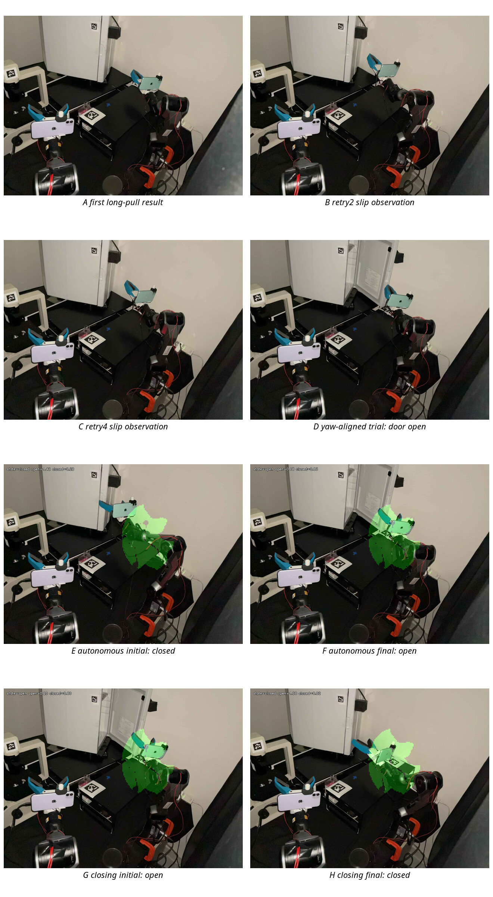

**Figure 3. World-state evidence across the learning chronology.** A--C are the
first long-pull result and later slip observations; they explain why wrist
contact evidence alone could not define success. D shows the yaw-aligned trial
after the door had opened. E--F are the registered closed and open endpoints of
the promoted autonomous opening run. G--H are the registered open and closed
endpoints of the later autonomous closing run. The green overlay visualizes the
dynamic region used by the contemporaneous endpoint evaluator.

#### 17:29–17:52 JST: learning that closing is not the reverse of opening

An intuitive closing policy reversed the opening trajectory. It failed because
the opening handle-contact path was roughly 15 cm too high to push the door in
the needed place. A separately recorded open-jaw close demonstration,
`door_close_20260703_163736`, followed a lower pushing path and closed the door
without requiring grasp or rotation correction. The normal close executor was
therefore changed to use that dedicated demonstration. This is an example of
the program hypothesis changing structure rather than tuning a scalar gain.

#### 19:01–19:08 JST: integrating observation, action, and endpoint state

The components were assembled into `run_incubator_door_autonomy.py`. The first
invocation failed before motion because native camera log text and JSON were
mixed in one process output and the orchestrator could not parse the result. A
parser patch extracted the outermost process JSON. Another retry correctly sent
no commands when its preconditions were not met. The next retry opened the
door and classified the open endpoint. A subsequent close run reached the
closed endpoint.

The state mask initially included part of the robot arm, allowing arm motion to
pollute the door-state comparison. Without moving the robot again, the mask was
restricted to the intersection of the closed vertical plane and the regions
whose depth differed between verified open and closed references. This
hardening was committed after the successful run and made the classifier more
fail-closed.

### 5.5 The final opening program

The promoted opening path is:

```text
capture fresh head RGB-D
  -> register fixed scene fiducials
  -> classify initial door endpoint
  -> fit front door plane and compute bounded yaw residual
  -> move open jaws to retargeted pre-close
  -> optionally apply bounded wrist-view lateral correction
  -> apply demonstrated pre-close-to-contact transform
  -> close once and measure aperture stability
  -> replay first 5 mm as a proof pull
  -> re-check aperture at rest
  -> replay remaining contact-relative trajectory in checkpoints
  -> stop and locally retreat if aperture indicates slip
  -> capture fresh head RGB-D
  -> classify the final registered endpoint
```

The closure gate samples aperture at 20 Hz and requires at least ten terminal
samples. The settled range must be at most 0.04, and the aperture must exceed
the empty-grasp upper bound of 0.02. After the proof pull, the aperture must
retain at least 65% of its initial non-empty value. During the long pull, a
checkpoint is evaluated every 15 demonstration frames. The motion is streamed
at 30 Hz with a two-times time scale, giving a nominal duration near 9.86 s.

The endpoint classifier first registers live and reference images using fixed
AprilTags. The tags establish camera/scene registration; they do not represent
the door plane. Within a dynamic depth mask, the classifier compares the live
depth with independently stored open and closed endpoints. A missing closed
marker alone is not accepted as an open door. An ambiguous comparison yields
`unknown` and prevents another blind pull.

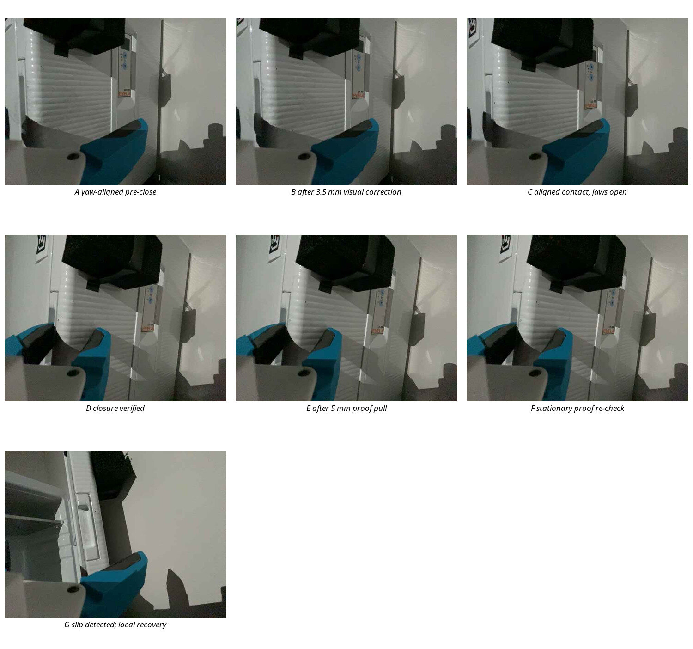

**Figure 4. Contact-scale stages in the autonomous opening path.** A is the
yaw-aligned pre-close view; B follows the single approximately 3.5 mm visual
correction; C is aligned contact with open jaws; D is the mechanically verified
closure; E is the 5 mm proof pull; F is the stationary proof re-check; and G is
the later slip observation that triggered local recovery. The final open-state
decision was made from the independent head RGB-D endpoint in Figure 5, not
from the apparent wrist geometry alone.

### 5.6 Autonomous opening result

The audited autonomous run is
`data/runs/pasteur/incubator_auto_open_20260808_demo_retry2/`.

| Stage | Recorded result |
| --- | --- |
| Initial endpoint | `closed` |
| Initial registration error | 0.0077 tag lengths |
| Initial relative open / closed errors | 1.42 / 0.28 |
| Live plane yaw | -4.61 degrees |
| Stored reference yaw | -5.38 degrees |
| Applied residual correction | +0.775 degrees |
| Wrist-view correction | one local step of approximately 3.5 mm |
| Settled aperture after close | 0.3057 |
| Aperture after 5 mm proof | 0.2957 |
| Long-pull event | later checkpoint detected 0.0034 < 0.0739 |
| Recovery | stopped; retreated before further observation |
| Final endpoint | `open` |
| Final registration error | 0.0084 tag lengths |
| Final relative open / closed errors | 0.18 / 0.83 |

The correct interpretation is precise. The robot established a verified grasp,
retained it through the 5 mm proof, and opened the door far enough to reach the
open endpoint. It did not retain the handle through the entirety of the long
pull: a later checkpoint detected a slip and stopped. The task-level opening
nevertheless succeeded before the slip, as verified independently after
recovery.

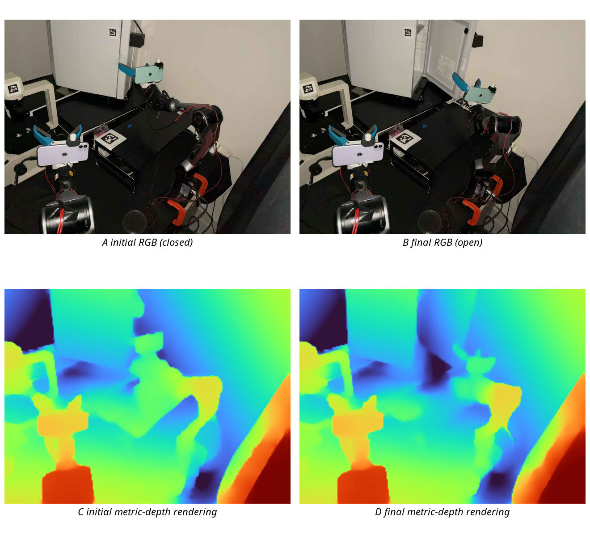

**Figure 5. Registered autonomous door endpoint evidence in RGB and depth.**
A and C are the initial closed RGB frame and its metric-depth rendering. B and
D are the fresh final observation after action and recovery; the exposed
interior supports the registered `open` result. Depth hue is only a rendering;
the reported endpoint errors were computed on metric values in the registered
dynamic mask.

### 5.7 Autonomous closing result

The dedicated close program used the lower, open-jaw demonstration rather than
reversing the opening path. The run
`data/runs/pasteur/incubator_auto_close_20260808_demo/` ended with
`status: success` and `state: closed`. The registered relative error to the
closed reference was 0.0179, while the relative error to the open reference was
1.0804. A moving-panel marker was visible and consistent with the registered
closed endpoint. Thus opening and closing were separately learned motion
structures sharing a common endpoint evaluator.

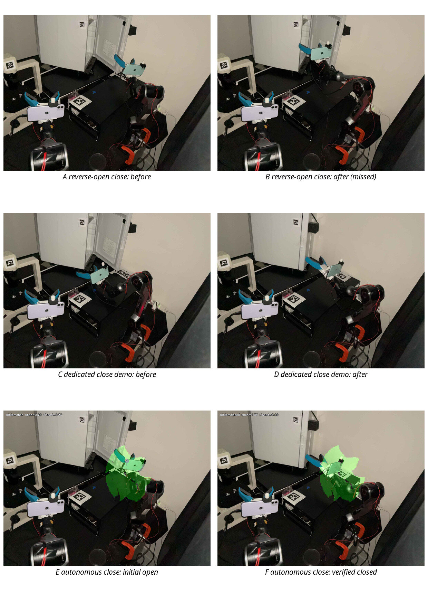

**Figure 6. Why closing became a separate learned structure.** A--B show the
failed attempt to close by reversing the opening path: the arm moved, but the
high handle-contact route missed a useful pushing contact. C--D show the lower,
open-jaw dedicated close demonstration. E--F show the autonomous closing run's
registered initial-open and final-closed observations. This comparison caused
the normal close executor to stop calling the reversed opening primitive.

### 5.8 What the repository learned from the door

The final door behavior encodes at least seven corrections that were absent
from generic replay:

1. rank demonstrations by physical pull but verify success visually;
2. represent motion relative to contact rather than in absolute coordinates;
3. estimate door yaw from metric depth rather than a shadow;
4. treat a rigid-parent visual label only as a bounded auxiliary correction;
5. distinguish commanded closure from non-empty, stable closure;
6. test a grasp with a short probe and monitor it during the long motion; and
7. judge completion from a registered world endpoint rather than from the
   command sequence.

These corrections reside in source, configuration, compiled demonstrations,
and tests. They are therefore available to later executions without Codex being
present in the control loop.

### 5.9 External tool graph assembled for the door

The door capability was not produced by one neural network mapping pixels to
actions. Codex assembled the following graph from independently useful tools.
The table distinguishes the role of each tool from the program-level decision
that made it useful.

| Stage | External tool or interface | Concrete role | Program-level decision learned from evidence |
| --- | --- | --- | --- |
| Demonstration acquisition | Meta Quest teleoperation and synchronized HDF5/MP4 recording | supplied actions, robot state, and three camera streams | use human motion as raw experience, not as an unquestioned absolute replay |
| Demonstration compilation | `h5py`, OpenCV `VideoCapture`, NumPy, and Mink SE(3) | decoded 57 candidate episodes, paired video with state, found contact/proof/release frames, measured variability, and expressed poses relative to contact | rank by physical pull, admit only visually verified open endpoints, and retain the contact medoid plus relative motion |
| Metric observation | Record3D head-camera RGB-D capture | supplied synchronized RGB, metric depth, confidence, intrinsics, and robot state before and after action | re-observe the world at state transitions rather than infer it from commands |
| Scene registration | OpenCV ArUco AprilTag dictionaries, subpixel corner refinement, and `solvePnP` | registered the fixed camera view to the robot/cell frame | use tags as coordinate anchors, not as the manipulated door or its success label |
| Door orientation | NumPy RANSAC and SVD over Record3D points | fitted the incubator's vertical front plane and estimated its yaw | replace the shadow-based contact hypothesis with a bounded metric yaw residual |
| Local wrist correction | OpenCV HSV thresholding, morphology, connected components, and a fitted ridge map | tracked the red EYELA rigid-parent feature for a small lateral correction | allow at most a few bounded corrections; never substitute the label for handle identity |
| Motion synthesis | Mink SE(3), MuJoCo robot geometry, and the repository's Mink/`quadprog` IK solver | retargeted demonstrated poses and converted them into feasible joint motion | preserve the demonstrated contact-relative path while changing its world anchor |
| Physical execution | robot RPC, Piper CAN control, and trajectory streaming | sent staged right-arm and gripper commands | expose action as short, auditable stages rather than one opaque long replay |
| Contact measurement | Dynamixel gripper aperture feedback | distinguished empty closure, stable contact, proof retention, and later slip | require non-empty settled closure, a 5 mm proof, and checkpointed retention |
| Endpoint measurement | OpenCV AprilTag registration, RANSAC homography, warped metric depth, and an open/closed dynamic mask | compared a fresh capture with independently stored endpoint references | declare success from world-state evidence and return `unknown` when registration or separation is insufficient |
| Process reliability | short-lived subprocesses and a JSON run journal | isolated fragile Record3D native state and persisted every stage, stdout, stderr, and command flag | make observation/action stages restartable and parse the outer process JSON rather than assuming clean stdout |
| Promotion and audit | SHA-256 hashes, pytest, and Git commits | bound demonstrations and accepted source to reviewable evidence | retain only the tested hypothesis and make later code drift auditable |

The resulting promoted graph can be summarized as:

```text
Quest demonstrations -> HDF5/MP4 -> h5py/OpenCV compiler -> relative SE(3)
                                                           |
Record3D RGB-D -> AprilTag/PnP -> RANSAC door plane --------+
                                                           v
wrist RGB -> bounded OpenCV feature ----------------> Mink/MuJoCo IK
                                                           |
                                                           v
                                                RPC -> CAN -> robot
                                                           |
                      aperture checkpoints + fresh registered RGB-D
                                                           |
                                                           v
                                                  endpoint evaluator
```

SAM was considered in the broader perception and scene-reconstruction work,
but it was not a runtime dependency of the promoted fixed-cell door program.
Free-form segmentation of a small, partially occluded recessed handle did not
provide the most measurable control signal. The empirical winner was a hybrid
of a demonstrated contact frame, metric plane geometry, one tightly bounded
classical visual feature, and direct mechanical feedback. This negative tool
selection is important: an LLM's advantage is not that it always calls the
largest neural model, but that it can change tools when a more specific one
closes the physical loss loop better.

## 6. Case Study B: Learning to Remove and Transport a Bottle Cap

### 6.1 Task and demonstrated scope

The second task concerns a small white cap on a culture-media bottle recessed
between two equal-height platforms. The right gripper must approach with open
jaws, align the cap between its fingertips, close from the side, lift the cap
off the bottle, and transport it while maintaining the grasp.

The evidence supports **cap removal and held transport**. It does not support a
claim of threaded unscrewing, torque-controlled loosening, resealing, or
verified placement on a destination support. The cap was physically removed,
which functionally exposed the bottle opening, but no rotational thread motion
was commanded or measured.

This scope is scientifically important because the positive result required no
cap-specific teleoperation demonstration and no task-specific neural-policy
training. It did use empirical data:

- one target click supplied by the operator;
- natural-language corrections about object identity and scene geometry;
- seven hardware-observed open-jaw poses for local calibration;
- repeated images, depth, end-effector states, and aperture values from trials;
- a validated sequence of approach waypoints assembled during interaction.

We therefore call it *demonstration-free empirical program learning*, not
data-free learning.

### 6.2 Initial perceptual and geometric failures

The visually simple instruction “grasp the white cap” was under-specified in
the real scene. Selecting the largest white or bright component found the
gripper mount, phone, fiducial paper, or incubator label. A fixed image crop was
also unreliable because the gripper progressively occluded the bottle neck.

The initial scene model made a second error: it treated the bottle as though it
stood on a visible tabletop. In reality, the bottle was recessed in the gap
between two platforms of approximately equal height. A generic thin-object
grasp strategy developed for a Petri-dish lid consequently approached with an
inappropriate height and clearance assumption. If the gripper moved diagonally
or laterally near the cap height, it could strike the bottle or platform before
the jaws were centered.

Finally, visual proximity did not imply a correct grasp. The two jaws could
occlude the cap while passing beside it, close fully on empty space, or push the
bottle body. The task needed explicit object identity, support geometry, jaw
geometry, and post-contact evidence.

### 6.3 Chronology of empirical correction

#### 16:35–16:44 JST: replacing “white object” with relational identity

The first patches introduced a target adapter, a fixed-head observation path,
and a task profile. Early candidates showed that whiteness and component size
were not sufficient. The target representation was changed to a relation:

```text
the small white cap immediately above the selected coloured bottle neck
```

The operator clicked the intended object once. That normalized click became an
immutable identity anchor rather than a target recomputed globally on every
frame. Before severe occlusion, the system identified the coloured neck and its
white supported component. During final approach, it tracked only a local white
component near the anchored identity. This prevented a distant white part of
the robot from replacing the selected cap.

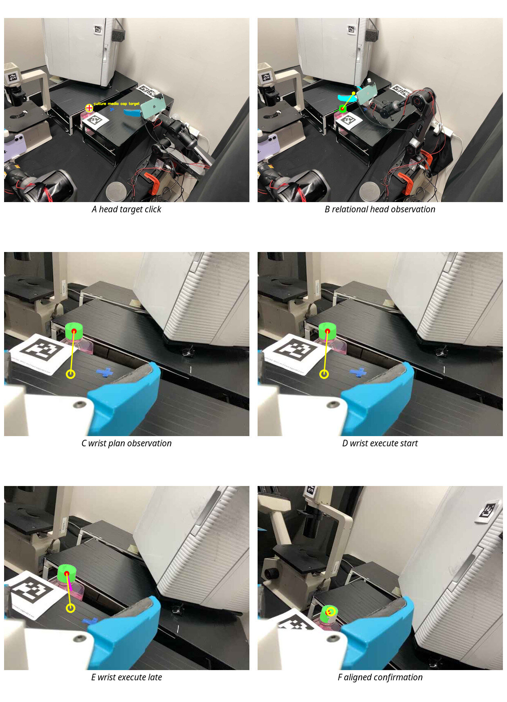

**Figure 7. From one identity click to contact-relative visual geometry.** A
records the single user click on the intended cap. B shows the head-view
relation between the target, the coloured bottle support, and the gripper.
C--E show the planned and executed wrist-view relation as the target approaches
the jaw midpoint. F is the aligned confirmation. The colored lines and circles
are outputs of the contemporaneous target/jaw evaluator, not post hoc object
annotations.

#### 16:44–17:06 JST: correcting the scene from physical observation

Fresh Record3D captures and coarse probes exposed the recessed bottle geometry.
The task profile was amended with the relation
`recessed_between_two_equal-height_platforms` and a downward completion from the
observed cap top. The motion strategy changed accordingly: align laterally in
free space, then descend vertically. Do not translate at cap height until the
object is detached.

This correction is central to the paper's thesis. A fixed action policy could
in principle learn the same behavior after suitable data. The code agent,
however, changed the explicit world representation, the ordering of motion
primitives, and the predicates governing when lateral motion was permissible.

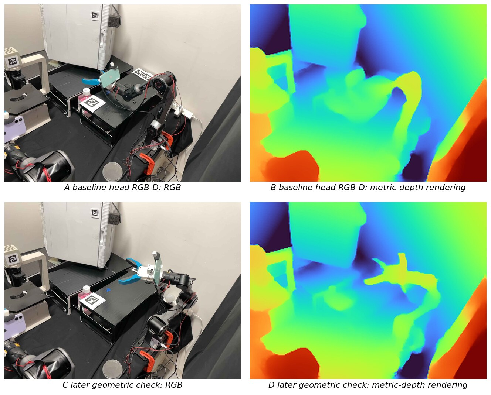

**Figure 8. Scene geometry that invalidated the inherited tabletop model.**
A--B pair the baseline head RGB observation with its stored metric-depth
rendering. C--D repeat the pairing during a later geometric check with the open
gripper displaced in free space. The bottle lies in the gap between the two
platforms rather than on the top surface assumed by the earlier Petri-object
controller. This observation changed the primitive ordering to lateral-first,
then vertical descent.

#### 17:20–17:37 JST: learning a local visual servo under occlusion

Open-jaw alignment trials supplied seven pairs of end-effector motion and image
displacement. From these observations, the code constructed a local \(2\times3\)
image-to-motion Jacobian relating small Cartesian changes to motion of the jaw
midpoint in the fixed head image. The stored Jacobian was

\[
J =
\begin{bmatrix}
-14.449 & -8.512 & 7.179 \\
-7.295 & -1.976 & -5.309
\end{bmatrix},
\]

with image error normalized by the current open-jaw span. At each iteration,
the program solved a bounded local correction, limited each Cartesian step to
15 mm, and allowed at most four final pre-close iterations. The control target
was the midpoint of the two detected jaw centers, not the wrist-camera optical
center or a fixed pixel.

As the jaws descended, the cap and neck became partially occluded. The program
separated three signals instead of asking one mask to do everything:

1. the immutable click preserved target identity;
2. a local white-component tracker estimated the cap near that identity; and
3. the coloured bottle body served as a support anchor whose motion indicated
   an accidental push.

After lateral alignment, controlled descent, and one occlusion-driven
backtrack, the jaws closed with an aperture near 0.201 rather than collapsing to
an empty full closure.

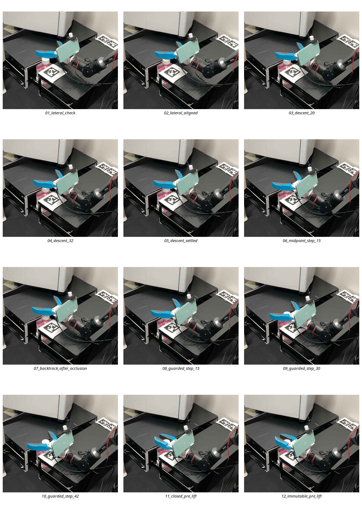

**Figure 9. Approach learning under progressive occlusion.** The sequence runs
from the initial lateral check through lateral alignment, 20- and 32-unit
descent stages, settling, midpoint correction, an occlusion-triggered
backtrack, three guarded re-approach stages, closure, and the immutable
pre-lift observation. It makes visible why a single target mask was
insufficient: the cap becomes hidden by the jaws, while the bottle body remains
available as a support-motion witness.

#### 18:04–18:06 JST: turning a plausible grasp into verified removal

The program first captured a held, pre-lift state. It then commanded a nominal
10 mm vertical probe and captured again. Forward kinematics measured an actual
vertical rise of 9.1748 mm. The bottle body shifted by only 0.0095 of its visual
scale, while the low-saturation bright component at the original cap location
fell to 0.3757 of its pre-lift amount. The jaw geometry moved upward and the
aperture changed by only 0.00086.

Only after these signals agreed did the program execute the validated egress
route toward home. The end effector moved a further 107.4155 mm while aperture
changed by only 0.00029 and the bottle support shift remained below its 0.10
normalized threshold. These captures became immutable positive evidence for
the promoted behavior.

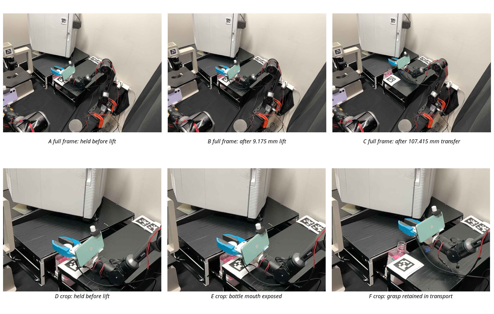

**Figure 10. Immutable RGB evidence for the promoted cap behavior.** The top
row preserves the full fixed-head context before lift, after the measured
9.175 mm lift, and after the 107.415 mm held transfer. The bottom row enlarges
the corresponding contact region: the cap is between the jaws before lift, the
bottle mouth is exposed after lift, and the cap remains held after transport.
The full-frame/crop pairs come from the same three captures.

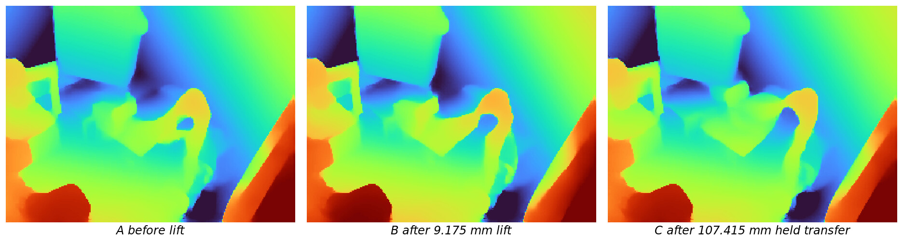

**Figure 11. Synchronized RGB-D evidence for the same three promoted states.**
The depth renderings show the changing robot/object geometry before lift, after
the 9.175 mm rise, and after held transfer. The small native depth maps are
enlarged without adding geometry. Quantitative displacement and support-motion
tests use the underlying metric samples and forward kinematics rather than
visual interpretation of these colors.

#### 18:09–18:14 JST: learning where to stop the claim

The robot descended, opened the gripper, and retracted in an attempted release.
However, the available image and depth evidence did not establish that the cap
was stably resting on the intended support after the gripper opened. The
program therefore did not promote placement.

This is not a failure of the removal result. It is an example of prefix-wise
learning: the repository learned and preserved the longest behavior supported
by evidence—identity, side pinch, removal, and held transport—while keeping the
next behavior disabled until it acquires its own evidence contract.

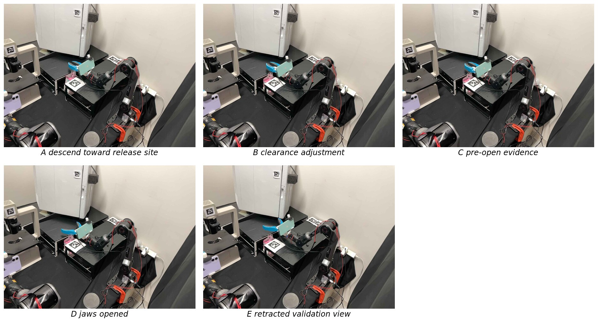

**Figure 12. Release was executed, but placement was not promoted.** A--C show
descent, clearance adjustment, and the pre-open state. D shows the jaws open;
E is the retracted validation view. These images verify that the actuator
sequence occurred, but they do not isolate a cap stably supported at a selected
destination and do not prove non-following during vertical retreat. The figure
therefore documents both the experiment and the boundary of the claim.

#### 18:29–18:37 JST: promoting an immutable hardware route

The stored captures were audited three times while the task contract, runner,
and tests were finalized. The exact validated approach/egress route was hashed.
A simulator-only false-positive collision could be overridden only when the
route hash and hardware evidence matched exactly. The resulting commit promoted
`cap_side_pinch_lift_and_held_transport` and explicitly left placement false.

Across the audited session, the cap runner was invoked 56 times, the RGB-D
capture path 31 times, cap-related tests eight times, and the final offline
audit three times. These counts are not presented as a sample-efficiency
benchmark because calls differ in scope—many are observations or millimeter
probes rather than complete attempts. They do show that the final capability
was the product of iterative experimental correction rather than a post hoc
description of one lucky motion.

### 6.4 The final cap program

The promoted portion of the state machine is:

```text
observe fresh scene
  -> bind identity to one user click and its supporting bottle
  -> move open jaws through validated free-space waypoints
  -> estimate jaw midpoint and cap error in the fixed head image
  -> apply bounded local Jacobian corrections
  -> descend only after lateral alignment
  -> close once
  -> verify cap-between-jaws + non-empty aperture + stationary support
  -> lift approximately 10 mm
  -> verify measured rise + source clearance + retained aperture
  -> transport on the exact validated egress route
  -> verify displacement + aperture persistence + support stability
```

The pre-lift closure gate requires all of the following:

1. the identity anchor projects within the segment between the two jaw centers,
   with perpendicular distance no more than 0.25 of the jaw span;
2. normalized aperture is within the calibrated non-empty band [0.10, 0.40];
3. displacement of the coloured bottle support is no more than 0.10 of its
   visual scale.

The removal gate requires at least 8 mm of measured vertical lift, visible jaw
motion, continued non-empty aperture, limited support shift, and a decrease in
the cap-like appearance at the source. The transport gate requires at least
50 mm of measured end-effector displacement, aperture drift no more than 0.05,
and continued support stability. Thresholds based on image geometry are
normalized by jaw span or support scale rather than hard-coded raw pixels.

### 6.5 Quantitative evidence

The immutable audit uses three fixed-head captures:

| State | Right end-effector XYZ (m) | Aperture | Relevant evidence |
| --- | --- | ---: | --- |
| Held before lift | (0.268797, 0.091341, 0.734345) | 0.20057 | target perpendicular distance = 0.1574 jaw spans |
| After lift probe | (0.269037, 0.093664, 0.743520) | 0.20143 | measured lift = 9.1748 mm; support shift = 0.00951 |
| Held after transport | (0.306625, 0.040875, 0.829185) | 0.20114 | transport = 107.4155 mm; aperture drift = 0.00029 |

At the source, the local white-component fraction changed from 0.4482 before
the lift to 0.1684 after the lift and 0.1698 after transport. Relative to the
pre-lift value, the source-appearance ratios were 0.3757 and 0.3787. These
appearance measures are auxiliary evidence of source clearance, not standalone
semantic classifiers.

The current audit returns:

```text
accepted: true
promotion_scope: cap_side_pinch_lift_and_held_transport
placement_promoted: false
placement_reason: release destination was not visually/depth verified
```

Figures 10 and 11 show the RGB and depth records used by this audit. Their
three columns refer to the same immutable capture triplet and are not selected
from different repetitions.

### 6.6 What the repository learned from the cap

The final program retains the following empirical corrections:

1. identify a target through an object-support relation and one immutable human
   click, not global whiteness;
2. represent the bottle as recessed between two platforms;
3. complete lateral alignment in free space before vertical descent;
4. estimate a local visual Jacobian from a small set of robot observations;
5. use jaw midpoint and jaw span as control geometry;
6. treat the bottle body as a stationary support witness;
7. separate closure, removal, transport, and placement into independently
   promotable stages; and
8. permit a simulator exception only for an exact route already verified by
   hardware evidence.

Like the door controller, this artifact can run without Codex after promotion.
The agent was required to acquire and revise the program, not to remain in the
high-frequency servo loop.

### 6.7 External tool graph assembled for the cap

The cap case used a different tool graph and is therefore a stronger test of
structural adaptation. There was no cap-specific action demonstration to
compile. Codex instead combined sparse human identity input, classical vision,
metric depth, numerical system identification, a simulator critic, and direct
hardware evidence.

| Stage | External tool or interface | Concrete role | Program-level decision learned from evidence |
| --- | --- | --- | --- |
| Target enrollment | one click in the fixed head image | supplied an immutable instance anchor | ask the human once which cap is intended, then prevent the tracker from silently switching objects |
| Semantic identity | OpenCV HSV conversion, morphology, connected components, and normalized component geometry | detected a small white component *above a coloured bottle neck* | replace “largest white object” with an object-support relation |
| Tool geometry | OpenCV segmentation of the cyan jaw material plus jaw midpoint/span calculations | represented where the open gripper would actually close | control the target into the segment between the jaws instead of toward a camera-frame box |
| Metric target pose | Record3D RGB-D, confidence, intrinsics, fixed AprilTag registration, and robust median back-projection | converted the selected cap mask into a 3-D surface point | separate target identity from metric localization and reject masks with insufficient valid depth |
| Completed scene model | Python XML `ElementTree`, catalog dimensions, and MJCF | replaced the stale target body with a completed bottle/cap collision object and disabled unobserved dynamic obstacles | combine visible surface evidence with size priors rather than pretending RGB-D observed every surface |
| Kinematics and collision critic | MuJoCo, Mink/`quadprog` IK, measured FK, and joint-path contact audits | checked candidate approaches against the reviewed cell and robot model | use simulation as a critic, not an infallible oracle |
| Local system identification | seven open-jaw observations, NumPy least squares/pseudoinverse, and small Cartesian probes | estimated the local mapping from robot displacement to jaw-midpoint image displacement | learn a local visual Jacobian when no demonstration or calibrated global image-to-robot map exists |
| Physical execution | robot RPC, Piper CAN control, joint-knot sampling, and trajectory streaming | executed free-space lateral alignment, vertical descent, closure, lift, and egress | align laterally before descent and preserve the exact verified route |
| Mechanical and world evidence | Dynamixel aperture, measured FK, fixed-head RGB-D, local source appearance, and support motion | tested non-empty side pinch, vertical removal, continued retention, transport distance, and stationary bottle support | promote closure, removal, transport, and placement separately; a release command alone is not placement evidence |
| Simulator disagreement | SHA-256 hash of the waypoint list plus immutable hardware audit | allowed one model-only collision false positive to be overridden for the exact proven route | scope exceptions to identical evidence-backed programs rather than weakening collision checks globally |
| Promotion and audit | timestamped JSON/images/depth/state, pytest, command-line audit, and Git | reproduced the accepted evidence contract without another robot action | preserve the longest verified prefix and make the claim independent of conversational memory |

The cap graph was:

```text
one click + head RGB -> OpenCV cap-above-neck identity -> selected mask
                                                          |
Record3D depth + fixed-tag registration ------------------+-> 3-D target
                                                          |
catalog priors + MJCF XML --------------------------> current MuJoCo scene
                                                          |
7 robot probes -> NumPy local Jacobian -> Mink/MuJoCo checks
                                                          |
                                                          v
                                                RPC -> CAN -> robot
                                                          |
                   aperture + FK + RGB-D + support witness
                                                          |
                                                          v
                                  removal/transport prefix evaluator
```

The promoted cap path also did **not** run SAM. At capability commit
`fc831c0`, `rollout/media_cap_target.py` imported two HSV bounds from a module
named `realtime_sam_servo`, but code inspection shows that these were only
constants for cyan gripper material. No SAM model was loaded and no neural mask
was invoked by the cap adapter. The actual target detector was the OpenCV
relational component procedure described above. SAM remained valuable for
adjacent broad scene parsing, but the fixed-cell cap evidence selected a
lighter and more inspectable runtime tool. This distinction prevents a module
name from being mistaken for causal model use.

## 7. Cross-Case Analysis

### 7.1 One learning loop, two kinds of supervision

The door and cap differ in their initial supervision but share the same update
mechanism.

| Property | Incubator door | Culture-media cap |
| --- | --- | --- |
| Initial action supervision | 12 verified teleoperation demonstrations selected from 57 candidates | 0 cap-specific teleoperation demonstrations |
| Human grounding | demonstration selection and semantic corrections | one target click and semantic/geometric corrections |
| Agent-created representation | contact-relative SE(3) trajectory and registered door plane | cap-above-neck relation, recessed support model, local image Jacobian |
| Mechanical contact evidence | stable partial aperture and 5 mm proof pull | target between jaws, partial aperture, stationary bottle body |
| Progress evidence | checkpointed articulated pull | measured vertical detachment and source clearance |
| Endpoint evidence | registered RGB-D open/closed classifier | 9.175 mm removal and 107.415 mm retained transfer |
| Promoted output | autonomous open endpoint and autonomous close endpoint | side pinch, removal, and held transport |

When demonstrations were available, the code agent did not discard them. It
compiled them into a representation better matched to variation and added
verification that the demonstrations lacked. When demonstrations were absent,
it treated small physical probes as system-identification samples and
constructed a controller. Program learning therefore changes how supervision
is consumed, not merely whether supervision exists.

### 7.2 Failure observations changed different parts of the hypothesis

The chronology reveals that physical loss did not always tune the same layer:

| Observation | Updated program component |
| --- | --- |
| Door starting pose was about 93 mm before contact | contact-frame representation |
| Successful door demonstrations varied by up to 36.1 mm | relative trajectory compiler |
| Dark feature was a shadow | perception and evidence source |
| 5 mm proof passed but long pull slipped | controller checkpoint structure |
| Reverse opening trajectory missed the close contact by about 15 cm | task decomposition and demonstration choice |
| Camera logs broke JSON parsing | orchestration and process interface |
| Robot arm contaminated endpoint depth mask | evaluator geometry |
| Largest white component was not the cap | object identity model |
| Bottle was recessed, not tabletop-supported | world model and motion ordering |
| Jaws occluded the neck | tracker decomposition and support witness |
| Release command lacked stable placement evidence | promotion scope |

A parameter-only framing can represent some of these corrections implicitly,
given suitable data and architecture. The program-level framing makes them
explicit and allows the learner to change which data, architecture, controller,
or evaluator is needed next.

### 7.3 The strongest tool is the one that closes the empirical loop

The development process considered segmentation, color, depth, fiducials,
simulation, demonstrations, kinematics, and direct robot-state signals. No
single tool dominated every stage.

- RGB-D plane fitting was decisive for door yaw.
- Fiducials were useful for camera registration but were not treated as the
  manipulated object.
- A bounded wrist-view feature was useful for millimeter-scale lateral
  correction but not for global handle identity.
- A relational color/shape adapter and one click were sufficient for cap
  identity in the fixed scene.
- Gripper aperture supplied direct mechanical evidence unavailable from an
  image mask.
- MuJoCo rejected candidate paths but was overruled only by an exact
  hardware-proven route when its reconstructed geometry was too conservative.
- SAM remained available for broad scene parsing but was not forced into a
  control role where simpler, measurable signals performed better.

The cross-case inventory separates *promoted* tools from *exploratory* ones:

| Tool family | Door | Cap | Status in promoted path |
| --- | --- | --- | --- |
| Task-specific teleoperation | supplied the open and close motions | absent | door only |
| HDF5/video mining | selected and compiled door demonstrations | not needed | door only |
| Classical color/component vision | bounded red rigid-parent correction | cap-above-neck identity and cyan jaw geometry | both, with different roles |
| Record3D metric RGB-D | plane yaw and endpoint state | selected surface, scene refresh, removal evidence | both |
| AprilTags and PnP/homography | camera/endpoint registration | fixed scene-to-camera bridge | both; never object identity |
| Numerical geometric estimation | RANSAC/SVD plane fit | median 3-D surface and pseudoinverse image Jacobian | both |
| MuJoCo/Mink | IK and robot geometry | IK, completed scene, and collision critic | both |
| Gripper aperture and measured robot state | closure, proof, and slip | pinch, lift, and retention | both |
| SAM | considered and used in adjacent scene work | considered and used in adjacent scene work | absent from both promoted runtimes |
| VLA/ACT task policy | possible lower-level alternative | possible lower-level alternative | absent from both reported capabilities |
| Hashes, tests, JSON journals, and Git | evidence and promotion | evidence and promotion | both, outside the servo loop |

Exploratory tool use still contributed when it falsified a representation. A
shadow-like image feature and repeated global visual correction were rejected
for the door. Global white-object selection and an incorrect tabletop model
were rejected for the cap. A conservative MuJoCo collision result was retained
as an explicit disagreement but did not erase stronger evidence from one exact
hardware-proven route. The learned artifact therefore includes decisions about
which tool has authority over which variable:

- demonstration data owns the local articulated motion;
- metric depth owns visible surface geometry;
- catalog dimensions own completion of unobserved object volume;
- fixed tags own registration, not target semantics;
- the simulator owns a conservative geometric critique, not physical truth;
- gripper and robot state own mechanical contact and displacement evidence;
- fresh camera observations own task endpoints; and
- the human owns sparse semantic disambiguation when the sensors cannot.

The two histories should not be joined into one cross-task learning curve. The
Cap experiment and its promotion commits occurred on 6 August 2026; the
reported Door experiment occurred on 8 August. The tasks shared a robot and a
substantial infrastructure layer, but their task-specific tool graphs were
independently constructed. Figures 13 and 14 therefore retain task-specific
physical axes rather than collapsing unlike measurements into one subjective
performance score. The numbered graph stages summarize experimental
hypotheses and evidence transitions; several stages were consolidated into one
later Git commit and should not be read as one commit per plotted observation.

For Cap alignment, the image-plane target error is normalized by the measured
jaw span. The plotted observations are the final assessments preserved by the
scene-observe, coarse-probe, right-view, right-align, joint-probe, and
aligned-confirm runs. The coarse experiment made the error worse, from 1.188
to 1.760 jaw spans; changing viewpoint reduced it to 0.441, and the final local
calibration reduced it to 0.051. The transfer panel uses robot FK and the three
immutable held-state captures. It accumulates the measured 9.175 mm vertical
rise and the subsequent 107.415 mm three-dimensional end-effector displacement
while independent aperture and RGB-D evidence continued to support retention.

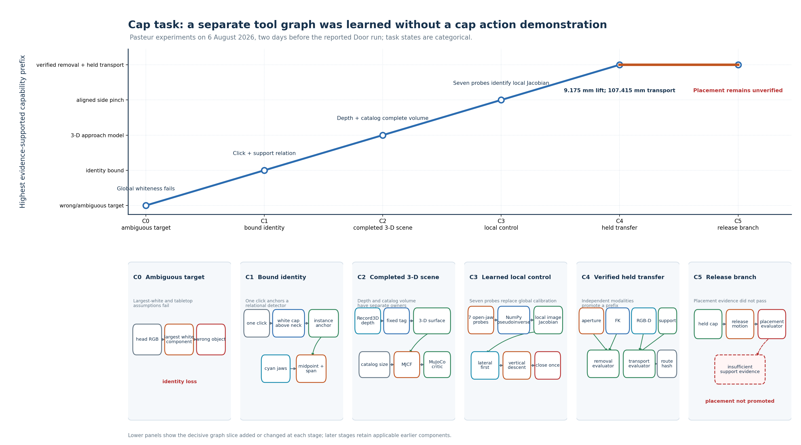

**Figure 13. Cap-specific quantitative evidence and tool-graph evolution.**
Panel A reports the jaw-normalized image error directly stored by the
relational cap-and-jaw detector; lower is better, and the non-monotonic coarse
probe is retained. Panel B reports cumulative verified held motion in
millimetres, not an assigned capability level. Global white-component
selection and an incorrect tabletop relation did not establish target
identity. A click-bound cap-above-neck relation, registered RGB-D,
catalog-completed MJCF geometry, and a seven-probe local Jacobian supported the
eventual side pinch and transfer. The release branch remains unverified and is
therefore not turned into a placement-performance sample.

For Door, let \(Z(p)\) be the observed metric depth after registration and
\(Z_{open}(p)\) the open-reference depth. The opening configuration comparison
uses the median absolute depth error over the valid shared dynamic mask \(M\):

\[
E_{open}=1000\,\operatorname{median}_{p\in M}|Z(p)-Z_{open}(p)|\quad\text{mm}.
\]

Lower error means a closer depth match to the open reference. This is a
camera-depth residual over visible surfaces, not the distance travelled by the
door, the handle displacement, or an opening angle. We applied
the current registered-depth implementation and hardened vertical-plane mask
with the same settings and reference pair to all four measurements. The current
deployment profile uses the D4 opening result as its own open reference; that
reference was replaced for this analysis to avoid an automatic error of zero.
The analysis instead uses the open-door observation recorded before closing
experiments at 17:29 JST and the final closed calibration capture. Neither
reference frame is one of the four scored images. These are distinct captures
from the same development session, not independent experimental trials.

The preserved D1 result has a depth error of 257.8 mm, D2 256.8 mm, D3 3.9 mm,
and D4 5.9 mm. These are computed residuals, without a calibrated uncertainty
interval; their decimal precision does not establish millimetre-level physical
accuracy. The small differences within D1--D2 or D3--D4 do not establish a
performance ranking. D1 and D2 remain classified as closed. The large decrease
in error coincides with the
D3 configuration, which includes metric yaw alignment. D0 has no identified
post-action RGB-D result. D5 changed the evaluator after the last physical
opening without another independent execution. Both remain N/A.

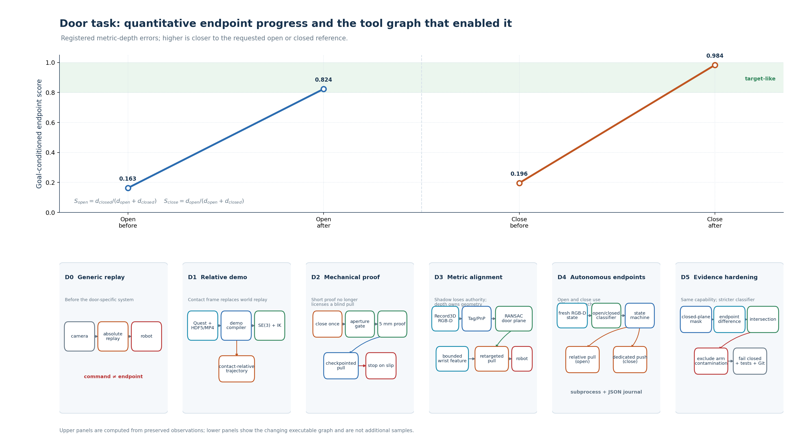

**Figure 14. Door depth error by executable agent configuration.**
The vertical axis is median absolute depth error to the open reference in mm
(lower is better). The same evaluator, mask, and reference pair assess one
selected post-action RGB-D observation per measured configuration. D1 is the first uninterrupted
contact-relative pull (which already included a short proof); D2 is the retry-2
checkpointed-pull slip observation; D3 is the yaw-aligned result; D4 is the
autonomous-opening endpoint. The lower panels emphasize the changes rather
than exhaustively enumerating each configuration. D0 and D5 remain missing.
This retrospective comparison describes observed endpoints, not success
probabilities or controlled ablation effects. Parameters, contact conditions,
and human interventions also changed during development.

#### Initial-approach quality as a proximal diagnostic

Endpoint depth changes mainly when the door actually opens. To measure an
earlier part of the behavior, we also re-evaluated the initial preclose of each
identifiable selected run, before its subsequent image-based correction. This
is **not** the first movement in the entire development history. The selected
runs match the D1, D2, and D4 runs in the endpoint comparison; earlier manual
experiments and unsuccessful retries are not converted into additional agent
configurations.

The fixed evaluator detects the red EYELA label on the rigid door parent in
the right-wrist image. Its target is the existing compiler's mean feature at
the close frame of twelve verified successful teleoperation demonstrations.
For image width \(W\), height \(H\), and label centroid \((u,v)\), we report

\[
E_{uv}=\sqrt{(u/W-\bar u_{goal})^2+(v/H-\bar v_{goal})^2}.
\]

This dimensionless image-position mismatch is a proximal diagnostic, **not**
a handle-center error in millimetres, a 3-D pose error, or a grasp-success
probability. In particular, the target comes from close frames while the
evaluated images precede contact. Stand-off, orientation, viewpoint,
segmentation, and occlusion can change the feature without an equivalent
change in grasp quality. End-effector command-tracking error is deliberately
not used: tracking an incorrectly aimed command well does not imply a good
approach.

| Configuration | Selected initial-preclose image | Position mismatch \(E_{uv}\) |
| --- | --- | ---: |
| D0 | not identified | N/A |
| D1 | `20260808T043120Z_demo_preclose/after/right.png` | 0.141824 |
| D2 | `20260808T044056Z_retry_preclose_registration/after/right.png` | 0.138008 |
| D3 | uncorrected first approach not established | N/A |
| D4 | `03_aligned-yaw-preclose/motion/after/right.png` | 0.061900 |
| D5 | no new physical execution | N/A |

We removed the log-area performance panel after a source-image audit found
segmentation instability. D4's initial red mask split into components of 280
and 109 pixels, of which the detector retained only the largest. About 1.51
seconds later, before the correction move and at the identical logged
end-effector pose, it detected 452 pixels instead. Thus the apparent scale
change cannot be attributed to the correction motion. Raw area diagnostics
remain in the evidence snapshot for audit, not as a performance axis. The
centroid metric can also be affected by partial detection; removing the area
panel does not establish that the remaining position metric is noise-free.
Neither the tiny D1--D2 difference nor the printed decimal precision establishes
a reliable ranking without repeated trials and uncertainty estimates.

D3 is missing because orientation probes, restored poses, and manual yaw
selection precede its final visual-alignment sequence. The `before` image of
that sequence must not be relabeled as an uncorrected first approach. D4's
journal explicitly identifies attempt 1, visual-check step 0. Its approach
already reuses the successful D3 anchor and incorporates live door-plane yaw;
the result therefore describes initialization in the same scene, not
generalization to an unseen object placement. The following correction
is followed by a position mismatch of 0.042177, versus 0.061900 in the initial
image. That is a **within-run** observation, not another configuration or
another initial-approach sample; image-to-image detector variation means the
whole difference should not be attributed to the commanded correction.

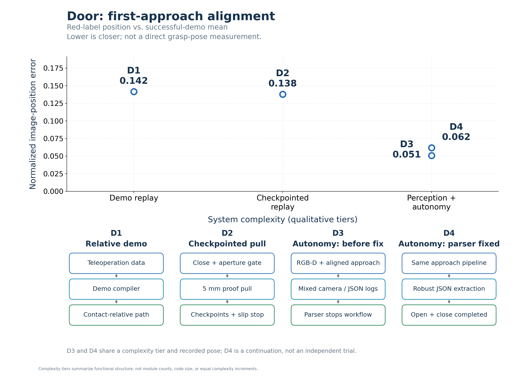

**Figure 14a. Initial-approach image-feature mismatch.** One selected run per
measured configuration, evaluated with the same detector and successful-demo
feature mean. Markers are not interpolated across missing configurations.
This diagnostic complements the endpoint result in Figure 14; it does not
replace task success or establish a smooth learning curve.

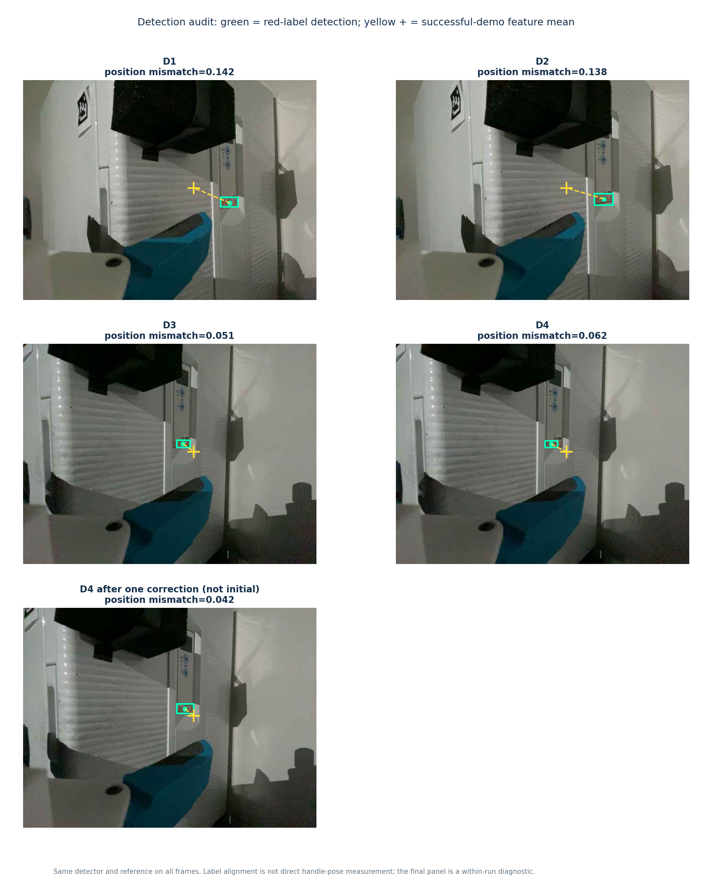

**Figure 14b. Source-image audit.** Green boxes/points show the detected red
label; yellow crosses show the successful-demo feature mean. D1, D2, and D4
initial images select the intended label rather than the dark shadow or blue
jaws. The fourth image shows D4 after one correction and is explicitly excluded
from the initial-approach comparison. The full source paths, SHA-256 hashes,
stage-selection reasons, formulas, and separate residuals are preserved in
`docs/assets/code_as_learning_machine/door_first_approach_report.json` and can
be recomputed with `python docs/evaluate_door_first_approach.py` without
connecting to the robot. Generate the plots and source-image audit with
`python docs/generate_code_learning_tool_graph_figure.py --include-source-audit`;
omit the flag when only the tracked evidence snapshot is available.

Time to verified opening is a useful additional metric, but the preserved
timing scopes differ. The D1 before/after observations bracket 8.66 seconds of
the long-pull stage and end with the door closed. The complete D4 autonomous
workflow, including observation, approach, proof, recovery, and verification,
lasted 86.96 seconds. These durations should not share a performance axis:
one starts after contact and proof, while the other includes the whole
workflow. A comparable future timing measure must fix the start condition and
success predicate and report unsuccessful or interrupted attempts separately.

This flexibility is a central benefit of code as a learning substrate. The
agent can import or call a large model when semantic ambiguity demands it,
combine it with geometric and hardware tools, or remove it from the critical
path when a calibrated predicate is faster and more reliable. In other words,
the empirical search is over both program logic and tool authority. Choosing
*not* to use a neural model can be a learned result rather than a retreat from
learning.

### 7.4 Code learning above VLA control

The comparison with VLA policies is best understood as a hierarchy:

```text
program-learning layer
  - selects sensors, tools, object frames, controller, evidence, recovery
  - may call a VLA, diffusion policy, ACT policy, geometric planner, or replay
                            |
                            v
motor-policy layer
  - emits smooth actions under the selected observation/action contract
                            |
                            v
hardware and independently recorded evidence
```

A future version could replace the door's demonstrated pull or the cap's local
Jacobian servo with a learned primitive while keeping the contact and endpoint
contracts. Conversely, if a VLA fails systematically because a camera is
mirrored or the success label is wrong, code learning can repair the surrounding
machinery before collecting more trajectories. The layers solve different
problems.

The difference can be stated in terms of what empirical optimization is
allowed to change. Standard policy training can optimize millions or billions
of weights, but normally holds fixed the camera decoder, sensor synchronization,
coordinate convention, simulator interface, actuator protocol, retry state
machine, and definition of success. In these experiments, several decisive
updates occurred precisely in those held-fixed components: an HDF5 compiler was
added, camera registration was inserted, a shadow feature lost authority, a
new depth-plane estimator was written, aperture checkpoints split a long
action, a local Jacobian was identified from probes, a stale MJCF object was
reconstructed, and the evaluator stopped promotion at held transport.

This is not a claim that source code has uniformly greater useful capacity than
a neural network, or that a sufficiently general learned agent could not
perform similar operations. It is a claim about accessible degrees of freedom
and persistence. The LLM code agent could use existing software and hardware
as callable modules, synthesize the missing adapters between them, alter the
graph after one informative physical failure, and save the accepted graph in a
form that ran without the LLM. An end-to-end VLA remains attractive inside this
graph for high-bandwidth visuomotor control. The code-learning layer addresses
the complementary question: *which* observations, tools, controller, and
evidence should define that motor-learning problem in the first place?

## 8. Evaluation Protocol for a Full Study

The present evidence establishes two concrete capabilities and their causal
development histories. A publication-quality empirical comparison should add
controlled repetitions and baselines. We propose the following protocol.

### 8.1 Primary outcomes

For each task and condition, report:

1. independent endpoint success rate over repeated resets;
2. number of complete robot attempts;
3. number and total displacement of diagnostic probes;
4. number of human action demonstrations;
5. number and type of human semantic interventions;
6. number of repository revisions before promotion;
7. wall-clock and robot-active adaptation time;
8. collisions, pressure stops, empty grasps, slips, and ambiguous endpoints;
9. inference/control-loop latency; and
10. fraction of runs for which the evaluator returns `unknown` rather than a
    false positive.

The unit of sample efficiency should distinguish a full task attempt from a
read-only observation or a 5 mm probe. Counting all CLI calls as equivalent
would obscure the mechanism.

### 8.2 Conditions and generalization

Door trials should vary initial door angle, small incubator translations and
yaw, lighting, and camera remounting within the supported registration range.
Cap trials should vary cap position, bottle position within the recess, cap and
bottle appearance, lighting, and target instance. Each change must be labeled
as in-distribution retargeting, re-enrollment, or an unsupported task change.

Cross-laboratory transfer should measure which artifacts are reusable:

- task semantics and evidence contract;
- controller structure;
- object-relative trajectory;
- camera calibration and scene model;
- object-specific thresholds; and
- exact hardware-validated routes.

The expectation is not zero adaptation. The meaningful quantity is how many
observations and code revisions are required to re-establish the contract in a
new cell.

### 8.3 Baselines

A useful comparison would include:

1. **Fixed script:** the initial generic replay or geometric controller, with
   no agentic revision.
2. **Demonstration replay:** nearest or medoid trajectory in absolute
   coordinates.
3. **Task policy:** ACT or a suitable VLA fine-tuned on the available
   demonstrations, using a fixed observation/action interface.
4. **Code generation without empirical revision:** a one-shot program produced
   from the task description and repository APIs.
5. **Full code learning:** iterative repository modification with immutable
   evidence gates.
6. **Hybrid:** full code-learning layer with a learned motor primitive.

The comparison should not assume that all methods receive identical kinds of
supervision. It should explicitly report demonstrations, target clicks,
pretraining, physical trials, human corrections, and compute.

### 8.4 Door ablations

The door task supports the following ablations:

- absolute replay versus contact-relative replay;
- no yaw correction versus RGB-D plane residual correction;
- aperture-only closure versus closure plus 5 mm proof;
- uncheckpointed versus checkpointed long pull;
- image-marker-only endpoint versus registered RGB-D endpoint; and
- reverse-open closing versus the dedicated close demonstration.

Expected failure modes are already visible in the development trace, but the
ablations should be repeated under controlled resets to estimate rates rather
than rely on historical anecdotes.

### 8.5 Cap ablations

The cap task supports a particularly clear progression:

1. global white component;
2. white component near a coloured bottle neck;
3. support relation plus immutable target click;
4. the above plus jaw-midpoint visual servo;
5. the above plus aperture verification; and
6. the full evaluator including target-between-jaws, stationary bottle support,
   measured lift, source clearance, and retained transport.

Additional ablations should compare a generic thin-object approach with the
recess-aware free-space-lateral-then-vertical path, and compare a fixed
image-to-motion mapping with the seven-observation local Jacobian.

### 8.6 Preventing post hoc success criteria

Before each repeated experiment, freeze:

- the evaluator version and thresholds;
- hashes of reference captures and trajectories;
- the allowed sensor streams;
- the maximum trial and probe budget; and
- the promotion scope.

If the evaluator is changed after observing a trial, the trial belongs to the
development set and must not be counted in the final test set. This separation
is the program-learning analogue of preventing test-set leakage.

## 9. Discussion

### 9.1 Is code really a model?

A model is an artifact whose state determines predictions or actions and whose
state is selected from data. The repository in these experiments satisfies
that functional definition. It maps observations and task intent to robot
actions, and its state changed in response to empirical outcomes. It is
structured, discrete, and human-readable rather than a homogeneous numerical
array, but that difference enlarges the available representations rather than
eliminating learning.

Calling the repository a model does not mean every source line was inferred
from scratch. Neural networks likewise inherit architectures, optimizers,
pretraining, and software. Here, robot APIs, general programming knowledge,
existing motion primitives, and prior demonstrations are inductive biases. The
learned content lies in how they were selected, connected, corrected, and
verified for the task.

### 9.2 Degrees of freedom and the need for stronger evaluation

Code has far more structural freedom than the weights of one fixed network. It
can change its input data, call a new model, install a library, define a new
coordinate frame, or introduce a state machine. That freedom is why the cap
controller could move from color segmentation to a support relation and a local
Jacobian without retraining an end-to-end network.

The same freedom creates a risk: the agent can accidentally alter the evaluator
or encode one experimental pose too specifically. Immutable evidence,
normalization by object/tool scale, explicit task contracts, test-set trials,
and Git review are therefore not peripheral engineering. They are the
regularization and evaluation machinery of program learning.

### 9.3 Human feedback as sparse empirical supervision

The human operator was not merely an emergency stop. Several concise
observations carried high information:

- the black door feature was a shadow;
- the red label belonged to the rigid door parent but was not the handle;
- the bottle was recessed between platforms;
- horizontal alignment should precede descent; and
- a release command was not proof of placement.

These statements changed object identity, geometry, controller ordering, and
evidence semantics. The resulting source captured the correction for future
runs. This suggests a productive interface for laboratory robotics: humans
provide sparse causal or semantic corrections at their natural level, while a
code agent translates them into executable and testable machinery.

### 9.4 Learning without keeping the agent in the servo loop

Neither promoted task requires a language model call at control frequency. The
agent operates during acquisition and revision; the final executor uses local
deterministic code and calibrated models. This has practical advantages for
latency, cost, reproducibility, and failure analysis. The process resembles
offline policy improvement followed by compiled deployment, except that the
compiled object contains heterogeneous algorithms rather than one policy
checkpoint.

An online code agent may still be useful when the deployed program encounters
an out-of-contract observation. The safe response is not unconstrained live
code generation while the robot is moving. It is to stop, preserve the new
evidence, propose and test a revision, and begin a new bounded trial.

### 9.5 Why the cap result is particularly informative

The cap experiment is small in physical distance, but conceptually strong. A
new contact task was acquired without a demonstrated action sequence. The
agent inferred which observations were missing, used the robot itself to
measure a local mapping, revised an incorrect scene relation, and wrote a
multi-modal definition of success. The final motion is simple because the
learning process discovered the right simplifications: fixed-head tracking,
free-space lateral alignment, vertical descent, one side pinch, a short lift
probe, and a proven egress.

This is not evidence that demonstrations are unnecessary in general. It is
evidence that task-specific demonstrations are not the only path to acquiring
a verifiable manipulation program. Small probes and human semantic feedback
can supply a different, highly structured form of supervision.

### 9.6 What Git contributes

Version control makes the program-learning trace unusually inspectable. The
door capability was introduced through commits adding shadow-robust replay,
dedicated closing, an autonomous state machine, hardened endpoint evidence, and
cross-lab registration. The cap capability was introduced through commits
adding the fixed-head grasp pipeline and then promoting only the verified
transfer prefix. A commit is not automatically a scientifically valid learning
step, but it provides a concrete hypothesis snapshot that can be tested against
the associated evidence.

This also makes regression visible. Later work can accidentally restore a wrong
left/right convention, obsolete scene, or gripper model. Pinning tests and
references to the accepted task commit is analogous to guarding a trained model
checkpoint from silent replacement.

## 10. Limitations and Next Experiments

The current results are proof-of-capability case studies, not yet a benchmark.
Their main limitations define a direct experimental agenda.

First, the autonomous door evidence contains one verified opening endpoint and
one verified closing endpoint. The opening grasp slipped during the long pull,
although the door had already reached the open state. Multiple independent
resets are required to estimate success and slip rates. Early pull geometry,
grip force, and handle contact should be optimized to retain the grasp through
the entire arc.

Second, the cap result ends at held transport. A complete placement capability
requires a freshly selected destination support, clearance between the held
cap and support, visual/depth evidence that the cap remains after opening, and
a vertical retract that does not carry the cap away. Threaded unscrewing and
resealing are separate future tasks requiring rotation and torque or slip
evidence.

Third, both successful pipelines were developed in one compact laboratory cell.
The door code includes later cross-laboratory registration machinery, and the
cap thresholds use normalized geometry, but neither fact alone proves transfer.
New-cell trials must distinguish what transfers unchanged from what requires
re-enrollment.

Fourth, the human-agent interaction was rich and sequential. Although the event
logs permit retrospective accounting, future experiments should predefine a
trial budget and classify each intervention online. This will enable direct
comparison with imitation learning, VLA fine-tuning, and one-shot code
generation.

Finally, physical program search carries real safety risk. New code must execute
through constrained adapters, begin with read-only observation and simulation,
use small diagnostic probes when uncertainty is local, and fail closed when
evidence is stale or ambiguous. The freedom to change software does not imply
permission to remove mechanical safeguards.

## 11. Conclusion

The central observation of this work is simple: a robot can learn not only by
changing numbers inside a fixed policy, but by changing the executable
machinery that senses, represents, acts, and verifies.

In the incubator task, the repository learned to convert variable
teleoperation demonstrations into a contact-relative articulated controller,
to replace a misleading shadow with metric plane geometry, to prove and monitor
contact mechanically, and to verify opening and closing from registered RGB-D
endpoints. In the culture-media task, it learned without a cap-specific action
demonstration: it bound one clicked cap to its supporting bottle, corrected the
recessed scene geometry, estimated a visual Jacobian from seven poses, and
required independent evidence for side pinch, 9.175 mm removal, and 107.415 mm
held transport.

The result is not merely code that makes a robot move. It is code that records
what the system learned from being wrong. Each successful repository revision
encodes a physical distinction—shadow versus surface, command versus contact,
motion versus endpoint, cap versus white distractor, support motion versus
object detachment. Because these distinctions persist as source, configuration,
tests, and immutable evidence, the learned behavior can execute without the
coding agent in the control loop and can be inspected, challenged, or extended
later.

Program learning should therefore be viewed as a layer above robot policy
learning. It can select a geometric controller for one stage, a demonstration
for another, a foundation segmenter for scene parsing, a simulator for path
criticism, and a VLA for a motor primitive. Its hypothesis space is broader,
but so is its responsibility to preserve independent evidence. The two case
studies suggest that this combination—structural freedom constrained by
physical verification—is a promising route toward robots that can acquire new
laboratory procedures from sparse interaction.

## Appendix A. Detailed Development Timeline

### A.1 Incubator door

| Date/time (JST) | Evidence or change | Interpretation retained in the final system |
| --- | --- | --- |
| 3 July–8 August | 57 candidate door-opening demonstrations accumulated | candidate behavior pool, not automatic success labels |
| 8 August, before live replay | top trajectories ranked by pull; 12 final head frames visually verified open | fixed verified demonstration set |
| 12:34–13:32 | retreat, orientation, lateral, hover, and pre-close probes | live start was not contact; anchor to demonstrated contact frame |
| 13:33 | close at retargeted contact, aperture 0.4123 | plausible non-empty grasp |
| 13:35 | 5 mm proof, aperture 0.3663 | proof useful but not sufficient |
| 13:36–13:46 | uninterrupted 135-point pull; aperture fell to 0.0034; endpoint not open | slow and checkpoint full pull |
| 13:52–14:06 | retries with 0.407/0.365, 0.323/0.319, and 0.293/0.291 close/proof apertures | non-empty contact can still be poorly seated |
| approximately frame 171 | repeated long-pull slip | checkpoint by trajectory progress, not only elapsed time |
| 14:11–14:48 | eight-frame RGB-D plane fit; yaw near -5.33 degrees | use metric plane residual |
| same period | human identifies black feature as shadow | prohibit shadow as contact or endpoint evidence |
| same period | bounded red-label lateral correction | rigid-parent auxiliary feature only |
| final yaw-aligned retry | proof held; later slip; door visibly open | preserve proof, checkpoint, recovery, endpoint separation |
| 14:54, commit `2b6ccab` | shadow-robust door replay added | first persistent door-specific learned artifact |
| 17:29–17:52 | reverse-open close missed useful push height by about 15 cm | closing requires its own demonstrated path |
| 17:53, commit `bfa9b7e` | dedicated demonstrated closing added | normal close path fixed |
| 18:13, commit `f2149bb` | autonomous state machine and endpoint model added | observe-act-verify integration |
| 19:01–19:03 | process-output parse failure, precondition stop, then successful retry 2 | orchestration is part of the learned machinery |
| 19:03 | autonomous run reaches registered `open` endpoint | primary open result |
| 19:06 | autonomous close reaches registered `closed` endpoint | primary close result |
| 19:08, commit `283b913` | endpoint mask hardened against robot-arm contamination | prevent evaluator shortcut |
| 23:45, commit `676981b` | cross-lab appliance frame machinery | subsequent transfer infrastructure, not cause of initial success |

### A.2 Culture-media cap

| Date/time (JST) | Evidence or change | Interpretation retained in the final system |
| --- | --- | --- |
| 6 August, 16:35–16:44 | target adapter, fixed-head capture, and initial click introduced | immutable identity and relational target |
| same period | largest-white candidates include robot and scene distractors | reject global whiteness and largest component |
| 16:44–17:06 | fresh RGB-D and coarse probes | scene geometry must be observed, not inherited from Petri task |
| same period | operator identifies bottle recess between two platforms | lateral in free space, then vertical descent |
| 17:20–17:37 | seven open-jaw observations and bounded alignment trials | local 2x3 image-to-motion Jacobian |
| same period | jaws occlude cap/neck during descent | separate identity anchor, local cap appearance, and bottle support witness |
| approximately 17:37 | pre-lift closure leaves aperture near 0.201 | non-empty side pinch candidate |
| 18:04 | immutable held-before-lift capture | baseline for geometry and appearance |
| 18:05 | nominal 10 mm probe produces 9.1748 mm measured rise | verified physical removal |
| 18:06 | end effector travels 107.4155 mm with aperture near 0.201 | verified held transport |
| 18:09–18:14 | release and retract attempted | motion occurred, but destination placement lacks evidence |
| 18:29–18:37 | repeated offline audits and contract hardening | promote only the verified prefix |
| commit `fc831c0` | fixed-head culture-cap grasp pipeline | persistent perception and approach program |
| commit `1f07761` | verified cylindrical-cap transfer promoted | immutable lift/transport contract and exact route |

## Appendix B. Reproducibility and Evidence Map

### B.1 Door source and artifacts

- `src/compile_incubator_door_demos.py`: demonstration compiler.
- `data/reference/pasteur/incubator/compiled_door_open_v1.json`: twelve
  demonstrations, hashes, contact statistics, and relative trajectory.
- `rollout/incubator_door_demo.py`: contact-relative trajectory operations.
- `rollout/incubator_door_plane.py`: RGB-D vertical-plane estimation.
- `rollout/incubator_door_visual.py`: bounded auxiliary visual alignment.
- `rollout/incubator_door_close.py`: dedicated close trajectory logic.
- `rollout/articulated_appliance.py`: registered endpoint classification.
- `src/run_incubator_door_demo.py`: staged diagnostic and replay executor.
- `src/run_incubator_door_autonomy.py`: promoted autonomous state machine.
- `src/configs/pasteur_incubator_door_demo.json`: task contract.
- `data/runs/pasteur/incubator_auto_open_20260808_demo_retry2/`: autonomous
  open journal and evidence.
- `data/runs/pasteur/incubator_auto_close_20260808_demo/`: autonomous close
  journal and evidence.

Read-only verification:

```bash
PY=/home/admin/miniforge3/envs/robot-test/bin/python

$PY -m pytest -q \
  tests/test_incubator_door_demo.py \
  tests/test_incubator_door_visual.py \
  tests/test_incubator_door_plane.py \
  tests/test_incubator_door_close.py \
  tests/test_articulated_appliance.py \
  tests/test_appliance_frame.py \
  tests/test_prepare_appliance_registration.py

jq '.status, .final_state.state' \
  data/runs/pasteur/incubator_auto_open_20260808_demo_retry2/journal.json

jq '.status, .final_state.state' \
  data/runs/pasteur/incubator_auto_close_20260808_demo/journal.json
```

The regression suite was re-run on 4 September 2026 and returned 26 passing
door-related tests.

### B.2 Cap source and artifacts

- `rollout/media_cap_target.py`: cap/bottle relation, click identity, local
  component tracking, and jaw geometry.
- `rollout/rgbd_target_scene.py`: target scene representation.
- `src/run_culture_media_cap_grasp.py`: observation, approach, servo, closure,
  lift, and transport executor.
- `rollout/cylindrical_cap_transfer.py`: robot-independent evidence gates.
- `src/configs/pasteur_culture_media_cap_grasp.json`: normalized contract,
  validated route, evidence paths, and unpromoted placement requirements.
- `src/audit_cylindrical_cap_transfer.py`: immutable offline audit.

Read-only verification:

```bash
PY=/home/admin/miniforge3/envs/robot-test/bin/python

$PY src/audit_cylindrical_cap_transfer.py \
  --task-profile src/configs/pasteur_culture_media_cap_grasp.json \
  --before data/captures/pasteur/2026-08-06/20260806T090454.207716Z_head_culture_media_cap_hold_before_lift_ce98d39c \
  --lift data/captures/pasteur/2026-08-06/20260806T090516.450533Z_head_culture_media_cap_lift_probe10_792a8b3c \
  --transported data/captures/pasteur/2026-08-06/20260806T090638.703002Z_head_culture_media_cap_transport_home_hold_c01dae62

$PY -m pytest -q \
  tests/test_media_cap_target.py \
  tests/test_cylindrical_cap_transfer.py
```

On 4 September 2026, the audit returned `accepted: true`; the tests returned
9 passed and 2 skipped. The skipped tests require transient head-view files
under `/tmp`; the integration test using the immutable transfer captures
passed.

## Appendix C. Capability Commits

| Commit | Persistent capability change |
| --- | --- |
| `2b6ccab` | shadow-robust door replay, demonstration compiler, RGB-D plane, bounded wrist correction |
| `bfa9b7e` | dedicated demonstrated incubator closing |
| `f2149bb` | autonomous observe-contact-proof-act-endpoint workflow |
| `283b913` | hardened endpoint parsing and depth evidence |
| `676981b` | later cross-laboratory appliance-frame retargeting |
| `fc831c0` | fixed-head culture-media cap grasp pipeline |
| `1f07761` | verified cap lift/held-transfer evaluator and promotion contract |

## Appendix D. Terminology and Claim Boundaries

**Code learning.** Empirical selection and modification of executable source,
configuration, models, and tests such that future robot behavior changes and
the change persists.

**Demonstration-grounded.** A task program constructed from action
demonstrations plus additional learned structure. The door is in this category.

**Demonstration-free.** No task-specific action sequence was supplied as a
teacher demonstration. This does not mean observation-free, interaction-free,
pretraining-free, or human-feedback-free. The cap is in this category.

**Contact proof.** A bounded physical test whose sensor consequences are
consistent with the intended grasp. It raises confidence but does not replace
the final task endpoint.

**Endpoint evidence.** A fresh observation of task-relevant world state that is
independent of the fact that an action command was sent.

**Promotion scope.** The longest consecutive behavior prefix for which all
required immutable evidence is present. Later unverified stages remain
disabled.

**Cap removal.** Vertical detachment of the cap from the bottle mouth. It does
not imply unscrewing unless rotational and thread/torque evidence is present.

## Appendix E. Figure Source Provenance

This appendix records the raw source family behind every curated figure. Paths
are relative to the repository root. The composites themselves are tracked in
`docs/assets/code_as_learning_machine/`; raw experimental data remains under
the ignored `data/` tree. Panel letters and stage labels in the figures provide
the ordering within each source family.

| Figure | Curated file | Preserved source evidence |
| --- | --- | --- |
| 1 | `door_verified_demo_endpoints.jpg` | Terminal frames extracted from the twelve `data/reference/pasteur/incubator/incoming/door_open/*_head.mp4` files whose stems occur in `compiled_door_open_v1.json:successes` |
| 2 | `door_right_learning_sequence.jpg` | Right-camera frames from `incubator_door_20260808T043016Z_demo_hover`, `T043120Z_demo_preclose`, `T043325Z_close_verify_demo_contact`, `T043548Z_proof_pull_demo_contact`, `T043620Z_open_door_demo_contact`, retry-2/4/5 proof and slip runs, and `incubator_door_20260808_retry6_yaw_aligned_{contact,proof,slip_observe}` under `data/runs/pasteur/` |
| 3 | `door_head_outcomes.jpg` | Head frames from the first long pull, retry-2 and retry-4 slip observations, the yaw-aligned open observation, and `state_evidence.png` from `incubator_auto_open_20260808_demo_retry2` and `incubator_auto_close_20260808_demo` |
| 4 | `door_autonomous_wrist_stages.jpg` | Right-camera frames stored in stages 03--08 and 10 of `data/runs/pasteur/incubator_auto_open_20260808_demo_retry2/` |
| 5 | `door_rgbd_closed_open.jpg` | RGB and depth renderings from the initial capture `20260808T100303.328276Z_head_initial_5e2b9e3f` and final capture `20260808T100427.298699Z_head_open_attempt_1_result_95dc7b74` nested in the autonomous run |
| 6 | `door_closing_comparison.jpg` | Before/after head frames from `incubator_door_close_20260808T083305Z_reverse_open` and `incubator_door_close_20260808T084010Z_peacock_demo`, plus registered endpoint evidence from `incubator_auto_close_20260808_demo` |
| 7 | `cap_target_and_wrist_grounding.jpg` | `culture_media_cap_tap_retry_20260806/tap_overlay.png`, head overlay from `culture_media_cap_adapter_20260806_scene_refresh_observe_v2`, right-view plan/execute frames from `culture_media_cap_grasp_20260806_stable_{plan,execute}`, and `culture_media_cap_adapter_20260806_aligned_confirm/right_aligned_overlay.png` |
| 8 | `cap_rgbd_scene_geometry.jpg` | RGB and depth from captures `20260806T074422.957478Z_head_culture_media_cap_home_scene_refresh_a4726ec2` and `20260806T081231.246190Z_head_culture_media_cap_aligned_open_descent_measurement_64aced88` |
| 9 | `cap_approach_learning_sequence.jpg` | Head RGB from the twelve ordered capture stages beginning `20260806T082127...recess_lateral_check`, continuing through lateral alignment, descent, backtrack, and guarded steps, and ending at `20260806T090454...hold_before_lift` |
| 10 | `cap_verified_transfer_rgb.jpg` | Full RGB frames and crops from `20260806T090454.207716Z...hold_before_lift`, `20260806T090516.450533Z...lift_probe10`, and `20260806T090638.703002Z...transport_home_hold` |
| 11 | `cap_verified_transfer_depth.jpg` | Stored depth renderings from the same three immutable captures as Figure 10 |
| 12 | `cap_release_attempt.jpg` | Head RGB from `20260806T090952.499727Z...place_descent40_check`, `20260806T091148.017296Z...place_clearance6_check`, `20260806T091251.693211Z...place_preopen`, `20260806T091320.073893Z...placed_released`, and `20260806T091401.642185Z...placed_retracted_validation` |
| 13 | `cap_tool_graph_evolution.png` and `.svg` | Generated by `docs/generate_code_learning_tool_graph_figure.py` from the tracked snapshot `quantitative_figure_evidence.json`, whose entries include raw-source paths and SHA-256 hashes. Alignment values come from six preserved `culture_media_cap_adapter_20260806_*` JSON reports; held motion is recomputed from right-arm FK in captures `...090454...hold_before_lift`, `...090516...lift_probe10`, and `...090638...transport_home_hold`. The lower graph follows the 6 August chronology and commits `fc831c0` and `1f07761` |
| 14 | `door_tool_graph_evolution.png` and `.svg` | Generated by the same script from `door_configuration_curve_report.json`, reproduced by `docs/evaluate_door_configuration_curve.py`. One fixed reference pair and the hardened registered-depth evaluator score preserved D1--D4 post-action RGB-D; D0 and D5 are missing. Raw inputs and evaluator files are bound by SHA-256. The reference captures differ from all scored frames but belong to the same development session. |

The twelve verified Figure 1 demonstration stems, in the compiler's stored
order, are `door_open_20260703_164850`, `door_open_20260703_163756`,
`door_open_20260703_173136`, `door_open_20260703_165810`,
`door_open_20260703_170229`, `door_open_20260703_175546`,
`door_open_20260703_180246`, `door_open_20260703_163437`,
`door_open_20260703_162442`, `door_open_20260708_151315`,
`door_open_20260703_164136`, and `door_open_20260703_175931`. Their SHA-256
hashes are retained in `compiled_door_open_v1.json`.

## Appendix F. Historical External-Tool Audit

This appendix guards against attributing a later repository state to the
original capability. The inventory was reconstructed from the files at the
capability commits using `git show <commit>:<path>`, then cross-checked against
the immutable run artifacts. It records causal program dependencies, not every
developer utility that happened to be installed on the computer. For example,
figure-production commands used while writing this manuscript are not robot
learning tools.

### F.1 Door tool evidence at the capability commits

| Historical source | Directly evidenced external facility | Role in the capability |
| --- | --- | --- |
| `2b6ccab:src/compile_incubator_door_demos.py` | `h5py`, OpenCV `VideoCapture`, NumPy, Mink | read HDF5 robot state and wrist videos; derive and compile contact-relative demonstrations |
| `2b6ccab:rollout/incubator_door_demo.py` | `h5py`, Mink SE(3), NumPy, SHA-256 | extract episode state, compose transforms, select the medoid, and bind source recordings by content hash |
| `2b6ccab:rollout/incubator_door_plane.py` | OpenCV ArUco/AprilTag detector, `solvePnP`, NumPy RANSAC/SVD | bridge RGB-D points to robot coordinates and estimate front-plane yaw |
| `2b6ccab:rollout/incubator_door_visual.py` | OpenCV HSV, morphology, connected components; NumPy ridge regression | produce only the bounded rigid-parent feature correction |
| `2b6ccab:src/run_incubator_door_demo.py` | Mink, the MuJoCo-backed `SingleArmIK`, RPC, measured aperture | execute retargeted stages and test contact/progress |
| `f2149bb:rollout/articulated_appliance.py` | OpenCV tag detection, RANSAC homography, perspective transforms, NumPy metric-depth comparison | classify registered open/closed endpoints independently of sent commands |
| `f2149bb:src/run_incubator_door_autonomy.py` | Record3D capture command, subprocess isolation, OpenCV, JSON journal | connect observation, action, recovery, and endpoint classification into one restartable state machine |
| commits `2b6ccab`, `bfa9b7e`, `f2149bb`, and `283b913` | Git history and pytest regression | preserve and harden the success path after physical trials |

The robot IK adapter loaded a MuJoCo MJCF model and called Mink's IK routine
with the `quadprog` solver. Piper motion and gripper commands crossed the
repository RPC service to the CAN-connected hardware. Record3D ran as the
external RGB-D acquisition service; the autonomous orchestrator intentionally
invoked it through a short-lived child command because long-lived native camera
state had proven fragile.

There is no import or model-load evidence for SAM in these promoted door files.
Its absence is consistent with the retrospective experiment record: SAM was a
candidate broad perception tool, while the accepted fixed-cell path used
registered depth, classical image operations, a demonstrated contact frame,
and aperture feedback.

### F.2 Cap tool evidence at the capability commits

| Historical source | Directly evidenced external facility | Role in the capability |
| --- | --- | --- |
| `fc831c0:rollout/media_cap_target.py` | OpenCV HSV, morphology, connected components; NumPy geometry | identify the cap through the cap-above-coloured-neck relation and locate it relative to the jaws |
| `fc831c0:rollout/rgbd_target_scene.py` | Record3D arrays, OpenCV, fixed-tag registration, NumPy back-projection, Python XML `ElementTree` | recover a metric visible surface and write a completed target body into a fresh MJCF scene |
| `fc831c0:src/run_culture_media_cap_grasp.py` | RPC, measured FK, OpenCV, NumPy pseudoinverse, MuJoCo path-contact audit, joint-knot streaming | acquire the local image Jacobian, approach laterally before descent, execute closure/lift/transport, and audit candidate paths |
| `1f07761:rollout/cylindrical_cap_transfer.py` | OpenCV/NumPy evidence, SHA-256 route binding | verify closure, removal, and held transport; scope a simulator-only override to the exact hardware-proven route |
| `fc831c0` and `1f07761` tests/configuration | pytest, JSON artifacts, Git history | preserve the target contract and promote only the evidence-backed behavior prefix |

The apparent SAM dependency deserves explicit source-level clarification. At
`fc831c0`, `media_cap_target.py` imported only
`GRIPPER_CYAN_HSV_LOWER` and `GRIPPER_CYAN_HSV_UPPER` from
`realtime_sam_servo`. Those are numerical HSV constants. The file did not load
a SAM checkpoint, create a SAM predictor, or request a SAM mask. The cap mask
was produced by OpenCV component logic. Therefore the promoted cap result is
accurately described as demonstration-free and task-specific-NN-free, but not
tool-free: it relied on a substantial graph of external sensing, numerical,
simulation, and hardware tools.

### F.3 Acquisition tools versus deployed tools

Three tool scopes should not be conflated:

1. **Acquisition-time tools** helped Codex create the program: repository
   search, shell commands, Git history, tests, stored image/depth inspection,
   and in the door case teleoperation data.
2. **Deployed runtime tools** executed after Codex left the loop: camera
   capture, OpenCV/NumPy geometry, Mink/MuJoCo computation, RPC/CAN control,
   and robot-state evidence.
3. **Exploratory tools** informed a rejection but were not retained on the
   promoted path: free-form visual interpretation, global-object heuristics,
   and SAM for these two fixed-cell target controllers.

This separation makes the central claim testable. The LLM did not succeed
because all external tools were treated as equally trustworthy. It succeeded
by changing their composition and authority in response to empirical loss, and
by compiling the accepted composition into deterministic code.

## References

[1] A. Brohan et al., “RT-2: Vision-Language-Action Models Transfer Web
Knowledge to Robotic Control,” 2023. <https://arxiv.org/abs/2307.15818>

[2] M. J. Kim et al., “OpenVLA: An Open-Source Vision-Language-Action Model,”
2024. <https://arxiv.org/abs/2406.09246>

[3] I. Singh et al., “ProgPrompt: Generating Situated Robot Task Plans using
Large Language Models,” 2022. <https://arxiv.org/abs/2209.11302>

[4] J. Liang et al., “Code as Policies: Language Model Programs for Embodied
Control,” 2022. <https://arxiv.org/abs/2209.07753>

[5] W. Huang et al., “VoxPoser: Composable 3D Value Maps for Robotic
Manipulation with Language Models,” 2023. <https://arxiv.org/abs/2307.05973>

[6] A. Kirillov et al., “Segment Anything,” 2023.
<https://arxiv.org/abs/2304.02643>

[7] OpenAI, “Codex use cases,” accessed 4 September 2026.
<https://learn.chatgpt.com/use-cases>

[8] E. Todorov, T. Erez, and Y. Tassa, “MuJoCo: A Physics Engine for
Model-Based Control,” IEEE/RSJ International Conference on Intelligent Robots
and Systems, 2012. <https://mujoco.org/>

[9] T. Schick et al., “Toolformer: Language Models Can Teach Themselves to Use
Tools,” 2023. <https://arxiv.org/abs/2302.04761>

[10] S. Yao et al., “ReAct: Synergizing Reasoning and Acting in Language
Models,” 2022. <https://arxiv.org/abs/2210.03629>
