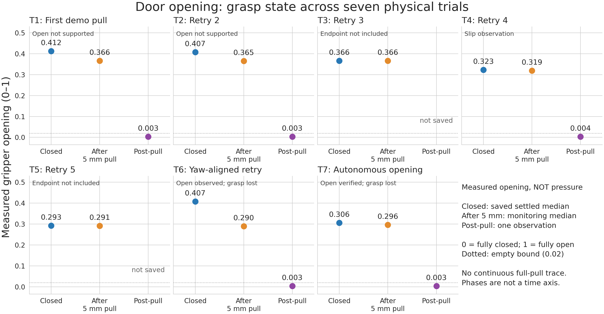
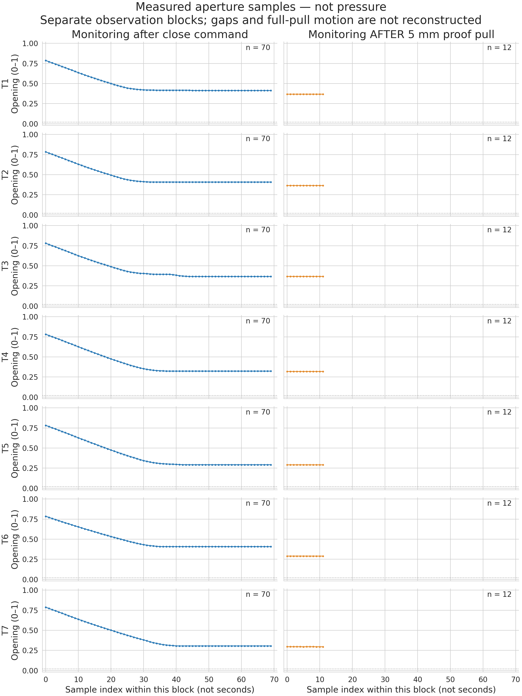
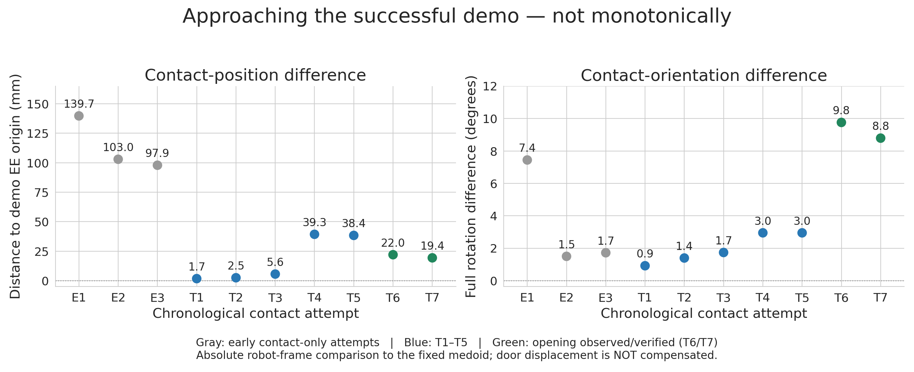
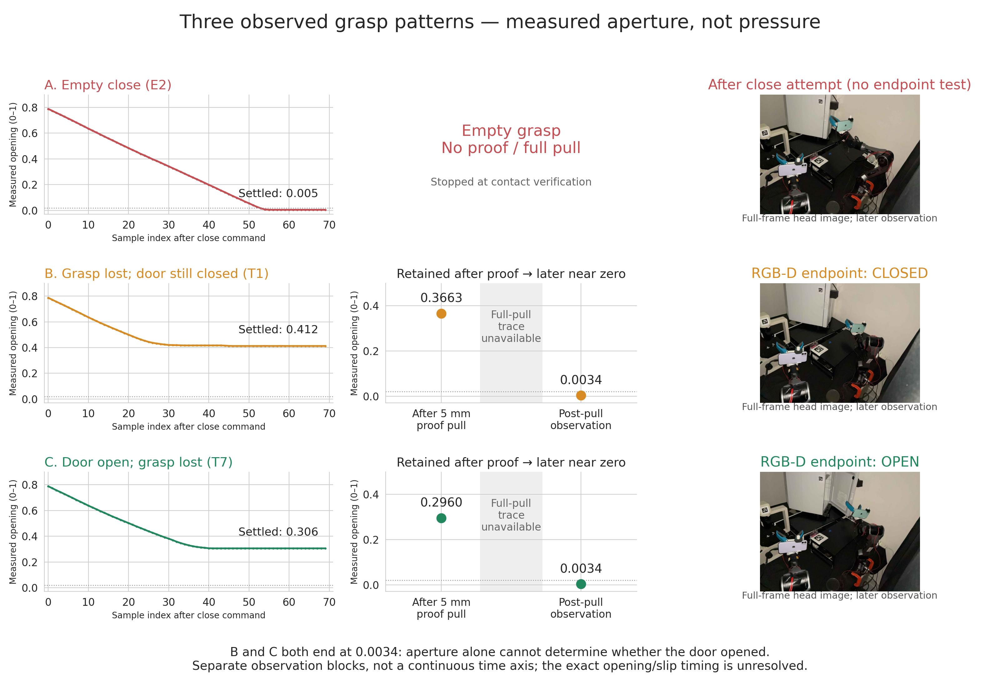
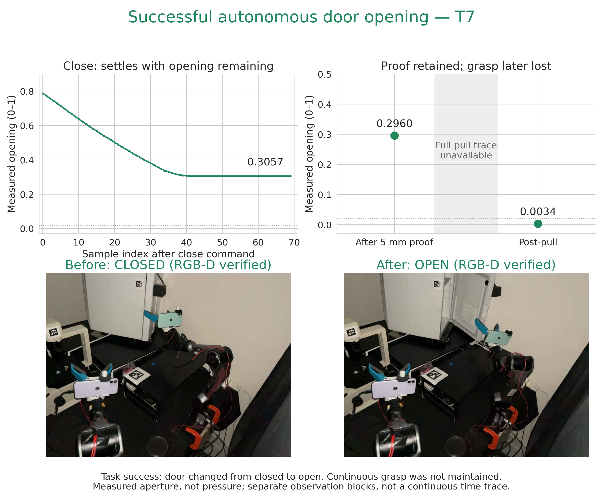
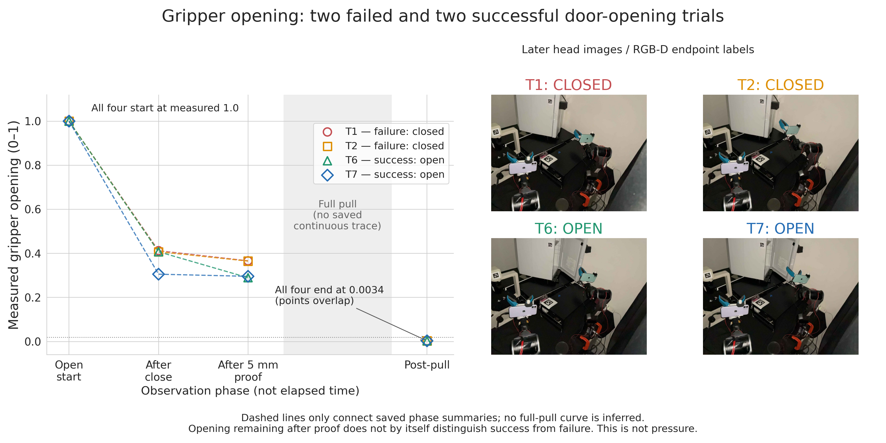

# Historical Door grasp signals

These figures show **measured gripper opening, not pressure**. The normalized
opening is dimensionless: 0 is fully closed and 1 fully open. It cannot be
converted into contact pressure or gripping force without additional sensing
and calibration. A blocked closing gripper does not prove correct handle contact.





## Scope and provenance

The seven rows are physical pull attempts on August 8, 2026. T1--T7 are not
the paper's D1--D4 code configurations and are not the human teleoperation demos.
T1 is the first long demo-relative pull, T2--T5 retries 2--5, T6 the yaw-aligned
retry, and T7 the endpoint-verified autonomous opening. Three earlier saved
contact-only attempts are listed separately in the audit report. This is not
a claim of exhaustive coverage of every historical physical interaction.

The report records exact source paths and SHA-256 hashes. The extraction pairs
contact and proof records and checks that their contact poses agree. It does
not extract numerical data from prose or manufacture missing samples.

An audit of 466 JSON files in `data/runs/pasteur/incubator*20260808*/` found arm
joint-torque snapshots and torque-warning summaries, but no contact-pressure
or gripper-current time series. These torque data are not interchangeable with
gripper pressure. The representative teleop HDF5 also contains poses, gripper
opening, timestamps and depth, but no force/current channel.

## Reading the figures

- **Closed:** the controller's saved settled aperture, the median of the last
  10 of 70 monitoring samples after the close command.
- **After 5 mm pull:** median of 12 samples collected **after** the proof motion.
  These are not samples during the motion.
- **Post-pull:** one saved observation after the long pull or its interruption.
  For T7 this is the observation before recovery. T3 and T5 are missing from
  the selected numerical sources and remain missing, not zero-filled.
- Each raw-sample curve belongs to a separate observation block. Individual
  sample timestamps were not saved; the x-axis is sample index, not seconds.
  Delays between blocks are not compressed into a purported continuous trace.
- No continuous full-pull trace or complete checkpoint history is reconstructed.
  These figures cannot identify the exact time of slip or peak contact load.
- The dotted 0.02 line is the controller's empty-aperture reference, not a
  physical force limit or a sufficient test of grasp success.

T6 and T7 opened the door but later lost the grasp. Accordingly, final near-zero
aperture must not be read as proof that the door-opening task failed. Conversely,
nonzero proof aperture did not guarantee that the handle would remain held
during the longer pull. Door-state evidence is separate; see the
[retrospective](PASTEUR_INCUBATOR_DOOR_OPENING_RETROSPECTIVE.md) and the existing
endpoint evaluation report.

## Reproduction

Plot from the tracked extracted measurements (no hardware or private transcript):

```bash
python docs/plot_door_grasp_signals.py
python -m pytest -q tests/test_door_grasp_signals.py
```

Re-extract and source-hash the original local JSON files:

```bash
python docs/plot_door_grasp_signals.py --rebuild-report
```

Outputs: `door_grasp_signal_report.json`, `door_grasp_aperture_trials.{png,svg}`,
and `door_grasp_aperture_samples.{png,svg}` in `docs/assets/code_as_learning_machine/`.
No robot-control code or logging configuration is modified by this analysis.

## Did the physical trials become closer to the demonstration?



The successful demonstrations' `right_gripper` channel contains only 0 and 1
in all twelve verified recordings. The collector's trigger-derived open/close
recording is consistent with this: see `teleop_collect_example.py`'s
`RecordingSample` construction. This is not the same measurement as the
continuous actual aperture read by the trial controller. Direct aperture-curve
matching would be invalid (and could incorrectly reward empty, fully closed
grasps for matching a zero-valued close command).

Instead, the additional figure compares every preserved August 8 contact pose
with the **fixed representative demo's contact pose**. E1--E3 are the three
early contact-only attempts. T1--T7 use the mapping above. The report includes
the reference and per-trial poses, numerical differences, source hashes, and
the per-demo binary-channel audit.

The robot-frame position differences initially fall from 139.7 to 103.0 to
97.9 mm, then to 1.7 mm at T1. However, later attempts are not monotonically
closer; successful T6/T7 differ by 22.0/19.4 mm, and their angular differences
are larger than T1's. No smoothing, best-so-far curve, trial omission, or fitted
registration is used to conceal this.

This metric is **absolute robot-frame EE discrepancy**, not distance to the
current handle. The user warned that the appliance had moved, and later
control incorporated live alignment. Also, the reference demo helped generate
the tested motions, so closeness to it is not held-out generalization evidence.
The supported narrative is that demonstrations corrected a large initial pose
mismatch, followed by environment-specific adjustment and verification—not
that monotonically reproducing the original absolute pose caused success.

Regeneration uses the same commands above and additionally produces
`door_contact_demo_comparison.{png,svg}`. Re-auditing raw demos requires h5py;
plotting the tracked report does not.

## Trial labels and three observed patterns

These labels were assigned for the retrospective figure; they were not
controller version names. Times below are saved pre-close observation times
on August 8, 2026, in JST, not exact first motor-command times.

| Label | Time | Meaning |
| --- | --- | --- |
| E1 | 13:05:05 | Early close verification: 12 samples still closing, failed stability gate; not sufficient to classify as empty from this block alone |
| E2 | 13:24:09 | Early empty close; aperture settled near 0.005 |
| E3 | 13:27:38 | Another early empty close; aperture settled near 0.005 |
| T1 | 13:33:27 | First demo-contact long pull; later aperture near zero, RGB-D endpoint closed |
| T2--T5 | 13:44--14:04 | Subsequent contact/proof/full-pull attempts |
| T6 | 14:42:21 | Yaw-aligned contact, proof and pull; open endpoint observed, grasp later absent |
| T7 | 19:03:46 | Autonomous orchestration with open endpoint verification; grasp later absent |

E1--E3 precede the direct demo-contact trials, not necessarily the arrival of
the demo files. D1--D4 in the code-complexity paper figure refer to different
code snapshots and must not be substituted for these trial labels.



This figure selects E2, T1, and T7 as observed examples. Left: the actual
close-monitoring samples. Middle: measurements after proof and after full pull,
with the unrecorded motion interval left blank. Right: the corresponding later
head image. E2 never reached the proof pull. T1 and T7 have the **same post-pull
aperture, 0.0034286**, but the frozen RGB-D endpoint evaluation classifies T1
as closed and T7 as open. This directly illustrates why aperture alone cannot
determine task success.

The third case is labelled "Door open; grasp lost" rather than asserting an
exact sequence of opening and slip: the sparse measurements do not identify
the moment the door became open relative to the moment of losing contact.
The images are later evidence, not synchronized to every point in the plots.

The tracked report includes per-case image paths and hashes, and the historical
endpoint report keys (distinct from trial labels). Display thumbnails preserve
the full frame and are downscaled. T7's raw portrait frame is rotated 90 degrees
clockwise, matching `load_bundle_endpoint`; there is no mirroring or retouching.
The frozen endpoint report is not re-fit for this comparison.

The standard plotting command now also generates `door_grasp_three_patterns`
in PNG/SVG. Local re-extraction generates three tracked JPEG thumbnails; the
default plotting command requires no original camera files.

## Successful opening, shown separately



This standalone figure labels the **door-opening task as successful** and
shows its independently classified closed start and open end, together with
the actual close/proof/post-pull aperture measurements. It is the same T7 as
case C above, not a newly discovered additional successful trial. Its grasp
was not maintained throughout the full pull. No preserved full-pull aperture
trace demonstrating continuously retained grasp was identified in the audited
door-run records; no idealized successful-grasp curve is substituted.

The initial state report and raw image are additionally source-hashed in
`successful_opening` in the tracked report. The standard command also emits
`door_grasp_success_T7.{png,svg}`.

## Overlay: two failed and two successful openings



The overlay uses T1/T2 (closed endpoints) and T6/T7 (open endpoints): all four
pull attempts with independently re-evaluated endpoints in the existing frozen
report. All four **measured** pre-close apertures are 1.0. This starting value
is not imputed for presentation. After-close and post-proof values are the
same saved summaries used above. The final four dots coincide at 0.0034286;
they are not jittered. Broken/dashed guides connect phases only up to proof;
no line traverses the unrecorded full-pull interval. Right-hand photographs
retain the full head frames and distinguish the door endpoints.

The selected successful examples have smaller post-proof openings, but this
tiny observational comparison does not establish an aperture threshold for
success. In particular other unsuccessful attempts also had smaller openings.
The endpoint labels are based on the door, not derived from these aperture values.

### Why the full-pull trace is missing, and what could be recovered

The historical implementation at `f2149bb` collected checkpoint apertures in
an in-memory list inside `_stream_retargeted_segment.gate`. If the aperture
fell below the bound, `gate` appended the reading and immediately raised
`TrajectoryStreamError`. The list was attached to the returned result only
**after** `streamer.execute()` returned normally, and the caller wrote its JSON
later. Consequently, the slip-triggered exception prevented all accumulated
checkpoint readings from being persisted. The first long pull predates the
checkpoint implementation and has only before/after aperture.

This is a historical logging limitation, not absence of real-time monitoring.
It is also not evidence of a high-frequency full-pull measurement stream: even
successful persistence would have provided sparse checkpoints, not 30 Hz samples.

The expanded search covered run JSON, stdout/stderr, matching local log/temp
files, and 642 tool-output records in the historical event-log window. Five
local stderr files preserve the failing reading, and the archived outputs also
preserve T6's error. In particular T3 and T5's stopping apertures can now be
recovered as **0.0034 rounded to four decimal places**, although their selected
post-pull observation JSON remains missing. No timestamped continuous full-pull
trace or complete checkpoint sequence was recovered. Repeated copies of an
error are not new samples. The precise original floating-point values cannot
be reconstructed from the rounded messages.

The audit outputs are in `door_pull_trace_audit.json`. Reproduce the local
stderr/source audit with:

```bash
python docs/audit_door_pull_trace.py
```

To include the optional private transcript audit, pass `--event-log PATH`.
Only numeric errors, line references, timestamps and metadata are exported;
commands from the transcript are never executed. The optional log remains
private and is not committed. The plot itself needs only tracked report data
and thumbnails.

Future logging should append each measured checkpoint and timestamp to disk
before evaluating the stop condition, including exceptions/termination. That
would prevent this particular data loss; no runtime control changes or new
physical trials were made for the present retrospective figure request.
